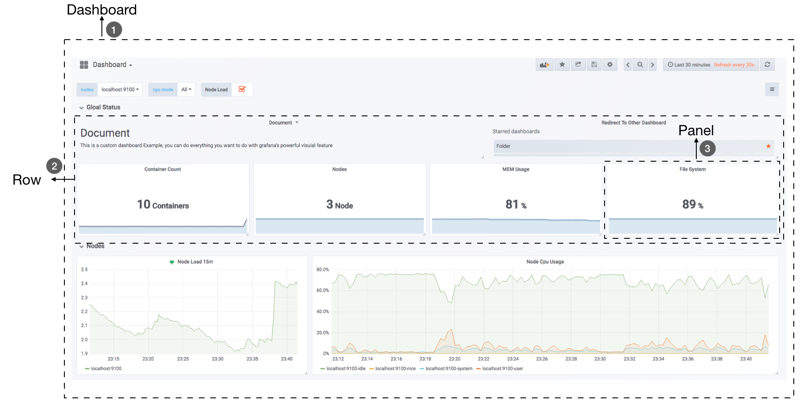
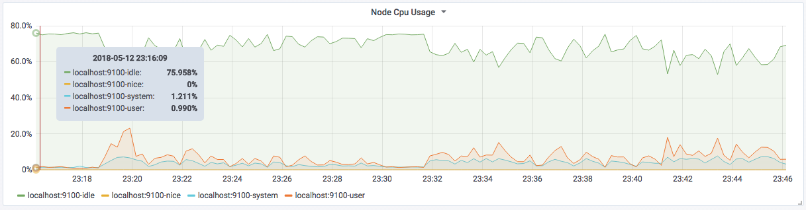
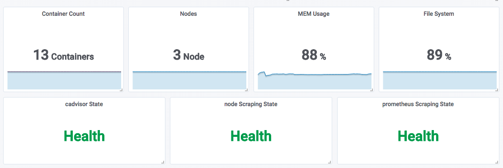

# 简介
是一个通用的可视化工具。
# 概念

## 数据源（DataSource）

为其提供数据的对象均称为数据源。

目前Grafana官方提供了对`Graphite, InfluxDB, OpenTSDB, Prometheus, Elasticsearch, CloudWatch, Mysql, Postgresql`等的支持。

## 仪表盘（Dashboard）
通过数据源定义好可视化的数据来源之后，通过Dashboard来组织和管理数据可视化图表。

`Grafana Dashboard`

如上所示，在一个Dashboard中一个最基本的可视化单元为一个**Panel（面板）**，Panel通过如趋势图，热力图的形式展示可视化数据。 

在Dashboard中每一个Panel是一个完全独立的部分，通过Panel的**Query Editor（查询编辑器）**可以为每一个Panel自己查询的数据源以及数据查询方式。

例如，如果以Prometheus作为数据源，那在 Query Editor 中，实际上使用的是 PromQL，而 Panel 则会负责从特定的 Prometheus 中查询出相应的数据，并且将其可视化。

由于每个Panel是完全独立的，因此在一个Dashboard中，往往可能会包含来自多个Data Source的数据。

Grafana 通过插件的形式提供了多种 Panel 的实现，常用的如：Graph Panel，Heatmap Panel，SingleStat Panel 以及 Table Panel 等。用户还可通过插件安装更多类型的Panel面板。

除了 Panel 以外，在 Dashboard 页面中，还可以定义一个**Row（行）**，来组织和管理一组相关的Panel。

除了 Panel, Row 这些对象以外，Grafana 还允许用户为 Dashboard 定义 **Templating variables（模板参数）**，从而实现可以与用户动态交互的Dashboard页面。

同时 Grafana 通过 JSON 数据结构管理了整个Dasboard的定义，因此这些Dashboard也是非常方便进行共享的。Grafana 还专门为 Dashboard 提供了一个共享服务：[https://grafana.com/dashboards](https://grafana.com/dashboards) ，通过该服务用户可以轻松实现 Dashboard 的共享，同时也能快速的从中找到我们希望的Dashboard实现，并导入到自己的 Grafana 中。

## 组织和用户

作为一个通用可视化工具，Grafana 除了提供灵活的可视化定制能力以外，还提供了面向企业的组织级管理能力。

在Grafana 中，Dashboard 是属于一个 **Organization（组织）**，通过 Organization，可以在更大规模上使用Grafana。例如，对于一个企业而言，我们可以创建多个 Organization，其中 **User（用户）** 可以属于一个或多个不同的 Organization。 并且在不同的 Organization 下，可以为 User 赋予不同的权限。 从而可以有效的根据企业的组织架构定义整个管理模型。

# 数据可视化

## Panel

Grafana中所有的面板均以插件的形式进行使用，当前内置了5种类型的面板，分别是：`Graph，Singlestat，Heatmap, Dashlist，Table，Text`。

其中像Graph这样的面板允许用户可视化任意多个监控指标以及多条时间序列。
而Siglestat则必须要求查询结果为单个样本。
Dashlist和Text相对比较特殊，它们与特定的数据源无关。

对于一个Panel而言，一般来说会包含2个主要的配置选项：General（通用设置）、Metrics（度量指标）。其余的配置则根据Panel类型的不同而不同。

在通用设置中，除了一些Panel的基本信息以外，最主要的能力就是定义动态Panel的能力。

在Metric选项中可以定义Grafana从哪些数据源中查询样本数据。**Data Source**中指定当前查询的数据源，Grafana会加载当前组织中添加的所有数据源。
其中还会包含两个特殊的数据源：**Mixed**和**Grafana**。 
Mixed用于需要从多个数据源中查询和渲染数据的场景。
Grafana则用于需要查询Grafana自身状态时使用。

**当选中数据源时，Panel会根据当前数据源类型加载不同的Query Editor界面。**

### 变化趋势：Graph 面板

Graph 面板是最常用的一种可视化面板，其通过**折线图或者柱状图**的形式显示监控样本随时间而变化的趋势。

Graph面板天生适用于 Prometheus 中 Gauge 和 Counter 类型监控指标的监控数据可视化。

例如，当需要查看主机CPU、内存使用率的随时间变化的情况时，可以使用 Graph 面板。
同时，Graph 还可以非常方便的支持多个数据之间的对比。

### 分布统计：Heatmap 面板

Heatmap 是是 Grafana v4.3 版本以后新添加的可视化面板，通过热图可以直观的查看样本的分布情况。在Grafana v5.1 版本中 Heatmap 完善了对 Prometheus 的支持。

### 当前状态：SingleStat 面板
Singlem Panel侧重于展示系统的当前状态而非变化趋势。

以下场景中特别适用于使用SingleStat：
- 当前系统中所有服务的运行状态；
- 当前基础设施资源的使用量；
- 当前系统中某些事件发生的次数或者资源数量等。

# 参考

https://geekdaxue.co/read/prometheus/grafana-intro#hxbbb

