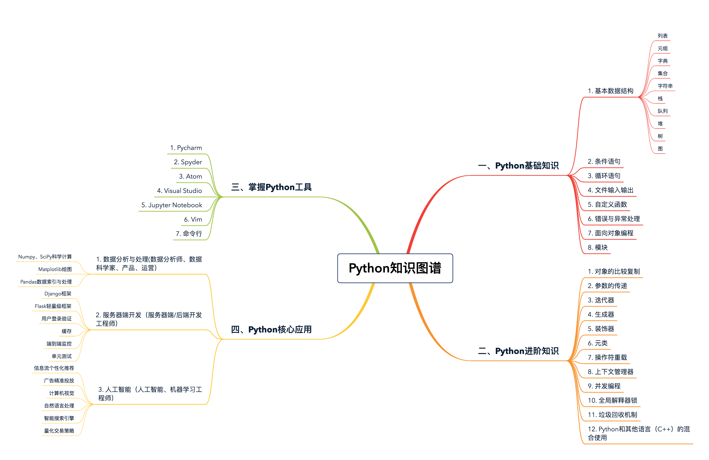

Python核心技术与实战

景霄

从事：

1、机器学习

2、人工智能的推荐排序系统与算法

工作中使用Python 开发了大数据采集和分析平台，使用`Django`实现了公司基础架构统计工具，同时还在使用Python与TensorFlow进行游戏、大数据以及深度学习相结合的研究工作。


学习编程语言的心得：

**1、从工程的角度思考学习，以实用为出发点，多练习、多阅读、多做项目，这样才能有质的提高。**

**2、从工程的角度去学习Python。**

**3、基础不牢，地动山摇。更深刻、实质的基础理解，才是更牢固的知识大厦的根基。**

**4、阅读源码，对于Python主要是CPython，用C写的，可能读起来比较费劲，需要一定的
C基础，但是很多时候也不需要详细知道每一句话的意思，大概知道这段干什么就可以了。**

**5、不同语言，需融会贯通。编程语言本就是人类控制计算机的指令，语法规则等方面自然大同小异。**

**6、不同需求选用不同语言。**

**7、大厦之基，勤加练习。计算机科学是一门十分讲究实战的学科，因此越早上手练习，练得越多越勤，就越好。**

**8、代码规范，必不可少。**


python应用领域：

1、数据处理

2、Web 开发

3、人工智能

4、量化交易系统

5、爬虫

6、运维

7、机器学习

8、TensorFlow


python学习的知识图谱




# 基础

循环结构while和for谁的效率高呢？

```python
# 代码中所有直接调用C的操作的语句肯定比通过Python间接调用C（Python的解释器是C写的）快的多。

# (A)
i = 0
while i < 100000000:
	i += 1

# (B)
for i in range(0, 100000000):
	pass

结论：
B比A快很多。
解释：
因为range这个函数是C写的，直接调用。
但是i += 1这个操作得通过解释器间接调用C，而这个简单的增值操作又涉及到object的创建和删除（i是immutable的），因此相对来说很耽误时间。
```


Jupyter Notebook是现代Python的必学技术。


李飞飞的 CS231N《计算机视觉与神经网络》课程 #todo

UC Berkeley 的《数据科学基础》课程 #todo


# 列表和元组

列表：list

元组：tuple

列表和元组，都是一个可以放置**任意数据类型**的**有序集合**。

1、列表

> 动态的，长度可变，可以随意的增加、删减或改变元素。
>
> 列表的存储空间略大于元组，性能略逊于元组。

2、元组

> 静态的，长度大小固定，不可以对元素进行增加、删减或者改变操作。
>
> 元组相对于列表更加轻量级，性能稍优。


在绝大多数编程语言中，集合的数据类型必须一致。不过，对于 Python 的列表和元组来说，并无此要求。

```python
l = [1, 2, 'hello', 'world'] # 列表中同时含有 int 和 string 类型的元素
l
[1, 2, 'hello', 'world']

tup = ('jason', 22) # 元组中同时含有 int 和 string 类型的元素
tup
('jason', 22)
```

列表是**动态的**，长度大小不固定，可以随意地增加、删减或者改变元素（`mutable`）。
而元组是**静态的**，长度大小固定，无法增加删减或者改变（`immutable`）。

```python
l = [1, 2, 3, 4]
l[3] = 40 # 和很多语言类似，python 中索引同样从 0 开始，l[3] 表示访问列表的第四个元素
l
[1, 2, 3, 40]

tup = (1, 2, 3, 4)
tup[3] = 40
Traceback (most recent call last):
File "<stdin>", line 1, in <module>
TypeError: 'tuple' object does not support item assignment
```

想对已有的元组做任何"改变"，该怎么办呢？那就只能重新开辟一块内存，创建新的元组了。

```python
tup = (1, 2, 3, 4)
new_tup = tup + (5, ) # 创建新的元组 new_tup，并依次填充原元组的值
new _tup
(1, 2, 3, 4, 5)

l = [1, 2, 3, 4]
l.append(5) # 添加元素 5 到原列表的末尾
l
[1, 2, 3, 4, 5]
```

和其他语言不同，Python 中的列表和元组都支持负数索引，-1 表示最后一个元素，-2 表示倒数第二个元素，以此类推。

```python
l = [1, 2, 3, 4]
l[-1]
4

tup = (1, 2, 3, 4)
tup[-1]
4
```

列表和元组都支持切片操作。

```python
l = [1, 2, 3, 4]
l[1:3] # 返回列表中索引从 1 到 2 的子列表
[2, 3]

tup = (1, 2, 3, 4)
tup[1:3] # 返回元组中索引从 1 到 2 的子元组
(2, 3)
```

列表和元组都可以随意嵌套。

```python
l = [[1, 2, 3], [4, 5]] # 列表的每一个元素也是一个列表

tup = ((1, 2, 3), (4, 5, 6)) # 元组的每一个元素也是一元组
```

可以通过`list()` 和 `tuple()` 函数相互转换。

```python
list((1, 2, 3))
[1, 2, 3]

tuple([1, 2, 3])
(1, 2, 3)
```

列表和元组常用的内置函数

```python
l = [3, 2, 3, 7, 8, 1]
l.count(3)
2

l.index(7)
3

l.reverse()
l
[1, 8, 7, 3, 2, 3]

l.sort()
l
[1, 2, 3, 3, 7, 8]

tup = (3, 2, 3, 7, 8, 1)
tup.count(3)
2

tup.index(7)
3

list(reversed(tup))
[1, 8, 7, 3, 2, 3]

sorted(tup)
[1, 2, 3, 3, 7, 8]
```

`count(item)` ：表示统计列表 / 元组中 item 出现的次数。
`index(item)`： 表示返回列表 / 元组中 item 第一次出现的索引。
`list.reverse()` 和 `list.sort()` ：分别表示原地倒转列表和排序（注意，元组没有内置的这两个函数)。
`reversed()` 和 `sorted()` 同样表示对列表 / 元组进行倒转和排序，但是会返回一个倒转后或者排好序的新的列表 / 元组。


**列表和元组存储方式的差异**

> 列表和元组最重要的区别就是，列表是动态的、可变的，而元组是静态的、不可变的。
>
> 这样的差异，势必会影响两者存储方式。

```python
l = [1, 2, 3]
l.__sizeof__()
64

tup = (1, 2, 3)
tup.__sizeof__()
48
```

放置了相同的元素，但是元组的存储空间，却比列表要少16 字节。

> 由于列表是动态的，所以它需要存储指针，来指向对应的元素。
>
> 另外，由于列表可变，所以需要额外存储已经分配的长度大小（8 字节），这样才可以实时追踪列表空间的使用情况，当空间不足时，及时分配额外空间。

```python
l = []
l.__sizeof__() // 空列表的存储空间为 40 字节
40

l.append(1)
l.__sizeof__()
72 // 加入了元素 1 之后，列表为其分配了可以存储 4 个元素的空间 (72 - 40)/8 = 4

l.append(2)
l.__sizeof__()
72 // 由于之前分配了空间，所以加入元素 2，列表空间不变

l.append(3)
l.__sizeof__()
72 // 同上

l.append(4)
l.__sizeof__()
72 // 同上

l.append(5)
l.__sizeof__()
104 // 加入元素 5 之后，列表的空间不足，所以又额外分配了可以存储 4 个元素的空间
```

列表空间分配的过程，可以看到，为了减小每次增加 / 删减操作时空间分配的开销，Python 每次分配空间时都会额外多分配一些，这样的机制（`over-allocating`）保证了其操作的高效性：增加 / 删除的时间复杂度均为 O(1)。

但是对于元组，情况就不同了。元组长度大小固定，元素不可变，所以存储空间固定。


实现：

list和tuple的内部实现都是array的形式，list因为可变，所以是一个over-allocate的array，tuple因为不可变，所以长度大小固定。

具体可以参照源码

list:
https://github.com/python/cpython/blob/master/Objects/listobject.c. 

tuple:
https://github.com/python/cpython/blob/master/Objects/tupleobject.c


结论：

**元组要比列表更加轻量级一些，所以总体上来说，元组的性能速度要略优于列表。**

Python 会在后台，会对静态数据做一些资源缓存（resource caching）。

通常来说，因为垃圾回收机制的存在，如果一些变量不被使用了，Python 就会回收它们所占用的内存，返还给操作系统，以便其他变量或其他应用使用。

但是对于一些静态变量，比如元组，如果它不被使用并且占用空间不大时，Python 会暂时缓存这部分内存。

这样，下次我们再创建同样大小的元组时，Python 就可以不用再向操作系统发出请求，去寻找内存，而是可以直接分配之前缓存的内存空间，这样就能大大加快程序的运行速度。


计算初始化一个相同元素的列表和元组分别所需的时间。我们可以看到，元组的初始化速度，要比列表快 5 倍。

```python
python3 -m timeit 'x=(1,2,3,4,5,6)'
20000000 loops, best of 5: 9.97 nsec per loop

python3 -m timeit 'x=[1,2,3,4,5,6]'
5000000 loops, best of 5: 50.1 nsec per loop
```

但如果是索引操作的话，两者的速度差别非常小，几乎可以忽略不计

```python
python3 -m timeit -s 'x=[1,2,3,4,5,6]' 'y=x[3]'
10000000 loops, best of 5: 22.2 nsec per loop

python3 -m timeit -s 'x=(1,2,3,4,5,6)' 'y=x[3]'
10000000 loops, best of 5: 21.9 nsec per loop
```

当然，如果想要增加、删减或者改变元素，那么列表显然更优。

原因就是对于元组，必须得通过新建一个元组来完成。


创建一个空的列表不同方式的效率问题

```python
# 创建空列表
# option A
empty_list = list()

# option B
empty_list = []
```

区别主要在于`list()`是一个function call，Python的function call会创建stack，并且进行一系列参数检查的操作，比较expensive。

反观`[]`是一个内置的C函数，可以直接被调用，因此效率高。


# 字典和集合

字典（dict）和集合（set）

字典是一系列由键（key）和值（value）配对组成的元素的集合，在 Python3.7+，字典被确定为有序（注意：在 3.6 中，字典有序是一个implementation detail，在 3.7 才正式成为语言特性，因此 3.6 中无法 100% 确保其有序性），而 3.6 之前是无序的，其长度大小可变，元素可以任意地删减和改变。


相比于列表和元组，字典的性能更优，特别是对于查找、添加和删除操作，字典都能在常数时间复杂度内完成。

而集合和字典基本相同，唯一的区别，就是集合没有键和值的配对，是一系列无序的、唯一的元素组合。


字典和集合的创建

```python
d1 = {'name': 'jason', 'age': 20, 'gender': 'male'}

d2 = dict({'name': 'jason', 'age': 20, 'gender': 'male'})

d3 = dict([('name', 'jason'), ('age', 20), ('gender', 'male')])

d4 = dict(name='jason', age=20, gender='male')

d1 == d2 == d3 ==d4
True

s1 = {1, 2, 3}
s2 = set([1, 2, 3])

s1 == s2
True
```

**Python 中字典和集合，无论是键还是值，都可以是混合类型。**

```python
s = {1, 'hello', 5.0}
```


元素访问

```python
d = {'name': 'jason', 'age': 20}

d['name']
'jason'

d['location']
Traceback (most recent call last):
File "<stdin>", line 1, in <module>
KeyError: 'location'

# 使用 get(key, default) 函数来进行索引。如果键不存在，调用 get() 函数可以返回一个默认值
d.get('name')
'jason'

d.get('location', 'null')
'null'
```

**集合并不支持索引操作，因为集合本质上是一个哈希表，和列表不一样。**

```python
s = {1, 2, 3}
s[0]
Traceback (most recent call last):
File "<stdin>", line 1, in <module>
TypeError: 'set' object does not support indexing
```

判断一个元素在不在字典或集合内，我们可以用 `value in dict/set` 来判断

```python
s = {1, 2, 3}

1 in s
True

10 in s
False

d = {'name': 'jason', 'age': 20}

'name' in d
True

'location' in d
False
```

增加、删除、更新等操作

```python
d = {'name': 'jason', 'age': 20}

d['gender'] = 'male' # 增加元素对'gender': 'male'
d['dob'] = '1999-02-01' # 增加元素对'dob': '1999-02-01'

d
{'name': 'jason', 'age': 20, 'gender': 'male', 'dob': '1999-02-01'}

d['dob'] = '1998-01-01' # 更新键'dob'对应的值

d.pop('dob') # 删除键为'dob'的元素对
'1998-01-01'

d
{'name': 'jason', 'age': 20, 'gender': 'male'}

s = {1, 2, 3}
s.add(4) # 增加元素 4 到集合

s
{1, 2, 3, 4}

s.remove(4) # 从集合中删除元素 4
s
{1, 2, 3}
```

注意：

**集合的 `pop()` 操作是删除集合中最后一个元素，可是集合本身是无序的，你无法知道会删除哪个元素，因此这个操作得谨慎使用。**


根据键或值，进行升序或降序排序

```python
d = {'b': 1, 'a': 2, 'c': 10}

d_sorted_by_key = sorted(d.items(), key=lambda x: x[0]) # 根据字典键的升序排序

d_sorted_by_value = sorted(d.items(), key=lambda x: x[1]) # 根据字典值的升序排序

# 返回了一个列表。列表中的每个元素，是由原字典的键和值组成的元组
d_sorted_by_key
[('a', 2), ('b', 1), ('c', 10)]

d_sorted_by_value
[('b', 1), ('a', 2), ('c', 10)]
```

对于集合，其排序和前面讲过的列表、元组很类似，直接调用 `sorted(set)` 即可，结果会返回一个排好序的列表。

```python
s = {3, 4, 2, 1}
sorted(s) # 对集合的元素进行升序排序
[1, 2, 3, 4]
```


字典和集合性能

**字典和集合是进行过性能高度优化的数据结构，特别是对于查找、添加和删除操作。**


对比列表和集合的性能

```python
import time

id = [x for x in range(0, 100000)]
price = [x for x in range(200000, 300000)]
products = list(zip(id, price))

# list version
def find_unique_price_using_list(products):
    unique_price_list = []
    for _, price in products: # A
    	if price not in unique_price_list: #B
    		unique_price_list.append(price)
    return len(unique_price_list)

# 计算列表版本的时间
start_using_list = time.perf_counter()
find_unique_price_using_list(products)
end_using_list = time.perf_counter()
print("time elapse using list: {}".format(end_using_list - start_using_list))
## 输出
time elapse using list: 41.61519479751587

# set version
def find_unique_price_using_set(products):
    unique_price_set = set()
    for _, price in products:
    	unique_price_set.add(price)
    return len(unique_price_set)

# 计算集合版本的时间
start_using_set = time.perf_counter()
find_unique_price_using_set(products)
end_using_set = time.perf_counter()
print("time elapse using set: {}".format(end_using_set - start_using_set))
# 输出
time elapse using set: 0.008238077163696289
```


**字典和集合的工作原理**

不同于其他数据结构，字典和集合的内部结构都是一张哈希表。

对于字典而言，这张表存储了哈希值（hash）、键和值这 3 个元素。
而对集合来说，区别就是哈希表内没有键和值的配对，只有单一的元素了。


**插入操作**
每次向字典或集合插入一个元素时，Python 会首先计算键的哈希值（`hash(key)`），再和`mask = PyDicMinSize - 1` 做与操作，计算这个元素应该插入哈希表的位置 `index =hash(key) & mask`。如果哈希表中此位置是空的，那么这个元素就会被插入其中。

而如果此位置已被占用，Python 便会比较两个元素的哈希值和键是否相等。

若两者都相等，则表明这个元素已经存在，如果值不同，则更新值。

若两者中有一个不相等，这种情况我们通常称为哈希冲突（hash collision），意思是两个元素的键不相等，但是哈希值相等。

这种情况下，Python 便会继续寻找表中空余的位置，直到找到位置为止。

通常来说，遇到这种情况，最简单的方式是线性寻找，即从这个位置开始，挨个往后寻找空位。当然，Python 内部对此进行了优化，让这个步骤更加高效。


**查找操作**
和前面的插入操作类似，Python 会根据哈希值，找到其应该处于的位置；然后，比较哈希表这个位置中元素的哈希值和键，与需要查找的元素是否相等。

如果相等，则直接返回；如果不等，则继续查找，直到找到空位或者抛出异常为止。


**删除操作**
对于删除操作，Python 会暂时对这个位置的元素，赋于一个特殊的值，等到重新调整哈希表的大小时，再将其删除。


不难理解，哈希冲突的发生，往往会降低字典和集合操作的速度。

因此，为了保证其高效性，字典和集合内的哈希表，通常会保证其至少留有 1/3 的剩余空间。

随着元素的不停插入，当剩余空间小于 1/3 时，Python 会重新获取更大的内存空间，扩充哈希表。

不过，这种情况下，表内所有的元素位置都会被重新排放。

虽然哈希冲突和哈希表大小的调整，都会导致速度减缓，但是这种情况发生的次数极少。

所以，平均情况下，这仍能保证插入、查找和删除的时间复杂度为 O(1)。


```python
# 初始化字典的方式，哪一种更高效？
# Option A
d = {'name': 'jason', 'age': 20, 'gender': 'male'}

# Option B
d = dict({'name': 'jason', 'age': 20, 'gender': 'male'})

直接｛｝的方式，更高效。可以使用dis分析其字节码

```


```python
# 字典的键可以是一个列表吗？
d = {'name': 'jason', ['education']: ['Tsinghua University', 'Stanford University']}

创建失败
字典的键值，需要不可变，而列表是动态的，可变的。可以改为元组
```


dis分析其字节码 #todo


