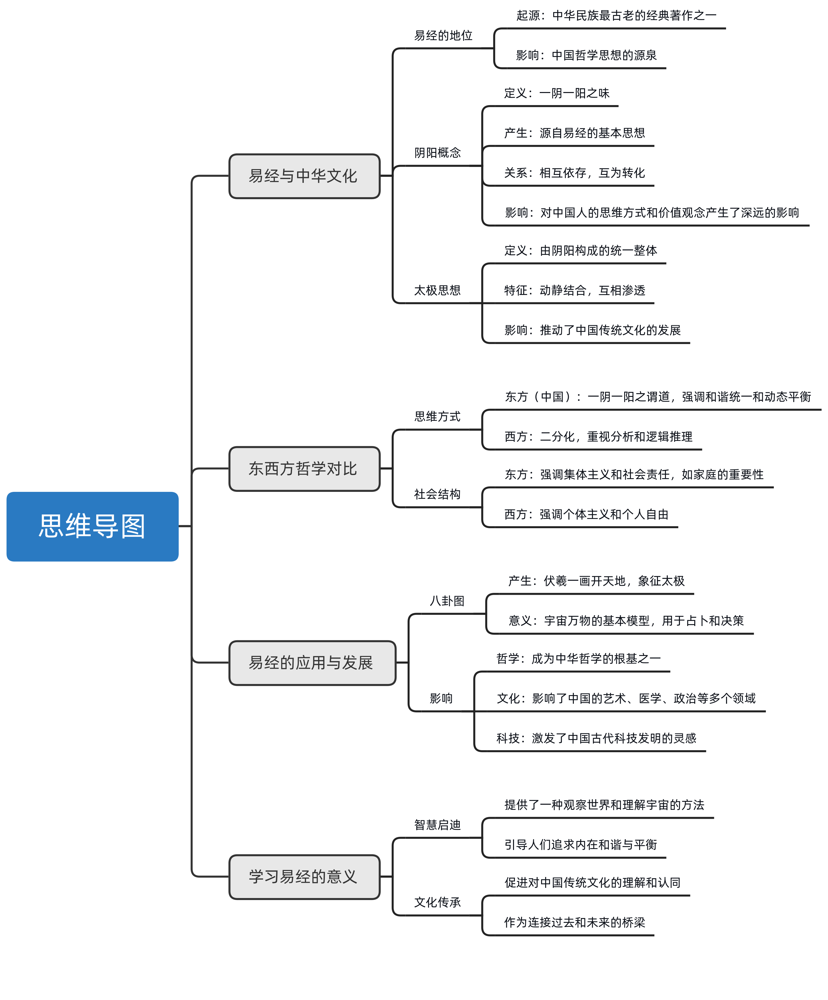
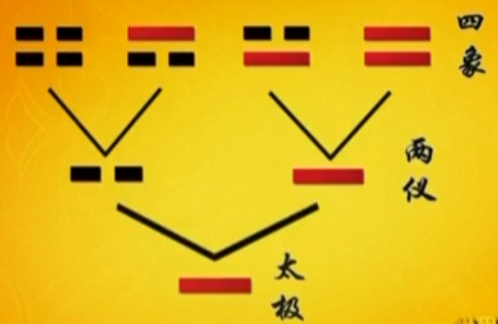

星空台

《世界文明讲坛》

# 0、摘要

《易经》作为中华哲学思想的源头，其阴阳理论阐述了万物相互依存、转化的两个方面，强调对立统一。

这一哲学思想深刻影响了中国古代的科技、医学、艺术等领域，并对现代人的思维方式和价值观念产生重要启示。

《易经》非传递具体知识，而是引导人们向深层次思考，洞察宇宙万物本质。

伏羲通过观察自然，运用符号和图像创造了阴阳学说，体现了人类的想象力和创造力。

阴阳理念体现了自然界和人伦道德的联系，影响了中国人的世界观和处理问题方式，促进社会和谐。

东西方对`一`与`二`的不同理解，反映了深层的文化价值观和世界观差异，对理解各自社会的发展路径具有重要意义。

《易经》不仅是中华文化的精神支柱，也是理解世界和自我的宝贵资源。

# 1、前言

中华民族最古老的经典著作《易经》，是中国哲学思想的起源。

无论是老子`道可道，非常道`之中的道，还是孔子的`吾道，一以贯之`中的一，都来源于《易经》中最基本的思想，那就是`一阴一阳之谓道`。

那么阴阳是怎么产生的，他们之间是什么关系？阴阳的思想对中华民族又有着怎样重要的影响呢？

台湾师范大学曾仕强教授将引领我们一起感悟《易经》的智慧，敬请收看阴阳之道。

# 2、易经哲学：阴阳相生万物化

> 易经作为中华哲学思想的源头，其阴阳理论深刻影响了中华民族。
>
> 阴阳的概念源自易经，指的是世间万物相互依存、相互转化的两个方面。
>
> 阴阳的哲学思想强调对立统一，认为一切事物都由阴阳两种相对属性构成，并通过不断的相互作用推动世界的发展变化。
>
> 这一思想不仅对中国古代的科学技术、医学、艺术等领域产生了深远的影响，而且对现代人的思维方式和价值观念也有着重要启示，体现了中国古代哲学的智慧和深度。

曾仕强：

我们只有一个地球，这句话现在大家都耳熟能详，因为听的太多了。

但是这句话到底是什么意思呢？

大家看过巴比伦的文化，希腊的文化，你说他不同，他又很相近，你说他相同，它又差得很远。

那到底是近还是远？到底是同还是不同？

你看西方他的所有的文明都是从神话开始。我想大家听了很多了，巴比伦与巴比伦的神话，希腊有希腊的神话，那当然中国也是很多的神话。

可是神话能满足人类的需求吗？你能够生活在神话当中吗？

我想不行的。

神话听听你总是将信将疑，到底这是在干什么？

因此，神话没有办法满足人类求知的欲望，所以就产生一种叫做哲学。

每个民族都有不同的哲学，而每个民族的哲学实际上都是从神话里面提升出来的。

神话只有一个目的，就是解答宇宙人生的问题。

哲学也只有一个目的，就是解答宇宙人生的问题。

但是哲学，大家总觉得好深好远，好像都在象牙塔里面。

我们中国自古以来，我们的哲学家从来没有生活在象牙塔里面。

你看孔子，他多半的贴近老百姓，老子他多么的深入我们的人心。

因为什么？因为我们是不分的，我们是合在一起的。

我们把理想跟现实合在一起，我们把高的跟低的拉在一起。

所以神话他慢慢形成哲学，哲学就变成什么？变成我们的智慧。

**神话 --> 哲学 --> 智慧**

我们的智慧是什么？就是一本《易经》了。

# 3、易经：探索智慧与创造的源泉

> 易经不仅是古代中国的哲学经典，更是探索人类智慧和创造力的根本源泉。
>
> 与传统观点不同，易经并非传递具体知识，而是强调通过减少个人欲望，引导人们向更深层的思考发展，从而洞察到宇宙间万物的本质和规律。
>
> 伏羲作为易经的主要创立者，其通过对自然现象的观察和思考，开创了通过符号和图像表达复杂概念的方法，揭示了天地万物相互作用的基本原理。
>
> 这一过程不仅体现了人类想象力的重要性，也反映了人们如何通过不断反思和创新，逐步深化对自然界和宇宙奥秘的理解。

我们对《易经》的认识应该要很明确的了解到，《易经》它不是告诉我们什么知识不知识的，它不是。

如果《易经》是一本讲知识的书，他老早就丢掉了。因为那么久了什么都变了，你这留着有什么用？

《易经》所给我们的是智慧。

《易经》告诉我们，一切都是人想出来的。

我们不用虚拟，我们用想象，通通是人想象出来的。

你说这是神话，那我请问你哪个民族他的学问不是从神话来？

那个时候哪有办法一下想的很具体，想的很现在所所讲的科学，那不可能的。

想象都是从模模糊糊，从不清不楚里面，然后慢慢去具体出现。

我们以前有手表吗？没有。就是有一个人在想想想了以后，手表就制造出来了。

我们以前有麦克风吗？没有。就是有人不断的想想想，想到最后，这个麦克风就制造出来的。

**所有的东西都是人想出来的**。我想这是《易经》给我们最高的一个答案。

《易经》告诉我们，一切一切都是人想出来的。

事实上，人类正是因为有了想象，才有了大千世界林林总总的发明和创造，才出现了各种各样的意识形态和思想流派，那么《易经》的思想又是谁想出来的呢？

**伏羲-画开天地**

就是伏羲想出来的。

大家一定很羡慕，我也能够想出这些东西来，那不是很好吗？

可以，的确可以，就一个方法而已。减少你的欲望，你就可以往正当的方面去想。

我们把想到的东西叫做天机，中文把那个叫做天机。

**嗜欲深者天机浅**

整天想股票，明天想我怎么样去买房地产，后天想我怎么样怎么样想半天的人，他这个天机是完全没有看到的。

**嗜欲浅者天机深**

完全在自己

伏羲去想的是人类最重要，而且是宇宙最高的一个秘密。

万物从哪里来？

伏羲氏看到太阳从东方起来，然后一直走从西方下去，他就知道了，天底下有一种力量，把太阳从东方拉起来，然后一直把它往西方掉下去。这个力量就使得万物都受到他的影响，好像它就是宇宙的根源。

那如果伏羲氏想到这里，我们就觉得这个人真是要虚拟，那真叫做虚拟。因为不切实际。

怎么会断定他不切实际呢？

太简单了

今天一个太阳出来，明天有一个太阳出来，哪有那么多太阳，一天一个，一年就三百多个，那还得了。

就算有那么多太阳，东方有那么大的太阳库可以储存吗？那边也有一个很大的太阳库，才能够一天掉一个。

所以伏羲氏他就自己否定自己。

我觉得这个对中国人也影响很大。

**人常常要反省**。

我们现在已经知道它不是事实，因为太阳它是永远存在的，只是地球自己在转。

所以有时候看得到，有时候看不到。

可是会不会影响到我们的思路？不会。

你看伏羲氏他最起码告诉我们，有看得见的部分就有看不见的部分。

有一个力量拉上来，就有一个力量拉下去，他就产生了有两种互动的力量的这种观念，一正一反。一上一下，这两个东西就构成了什么？

构成了太极里面的，两个重要的元素这一内涵。阴和阳。

因此，他就很想把他的思路把它表现出来。

但大家都知道，可是那个时候是没有文字的。

伏羲氏，他把这个力量用一个连续的线来代表。

我想这是很了不起的一种做法。

我没有文字，我说也说不清楚，我干脆画一个图像，画一个最简单的今天这个符号。

那时候是连符号这个观念都没有的，可见符号也是人想出来的。

他就画了这么一条线，也许当初连画的笔也没有，怎么画也画不出来，他就折一个树枝，就拿一段，说这个就代表那个能量，那个理念。

所以一画开天的真实的意义就是**一画开天辟地**。

# 4、太极与阴阳：中华哲学的核心概念

> 讨论了太极和阴阳作为中华文化核心概念的起源与发展，强调了伏羲通过观察自然、发挥想象力创造出这一套系统的重要性。
>
> 指出太极代表宇宙的根本力量，而阴阳则是描述这种力量相互作用的两个方面。
>
> 进一步探讨了阴阳之间的互动关系以及这种理念如何深刻影响了中国人的思维方式和处理问题的方式，强调了自然规律与人伦道德之间的联系。

我们讲到这里，已经很明确的知道，当初伏羲氏他是用眼睛去观察宇宙万象，然后他靠他的想象来替我们造出一套系统来。

这套系统的总根源就是一画，叫做太极。

我想，一切一切，都是从这样开始的。

伏羲认为既然有一个能量，有一个力量，有一个方向，就有一个相反的方向，就构成了一种叫做什么，循环往复，周而复始。

因此，他就认为有一个阴就有一个阳，有一个阳就有一个阴。

伏羲上观天文，下察地理，思索很久，终于一画开天地，这一画就是太极。

宇宙中的一切都是从太极中生发出来的。

孔子在他作的《十翼》，也就是《易传》中写道：`易有太极，是生两仪`。就是人们常说的，`太极生两仪`，意思是太极中包含的一正一反两种力量，而这两种力量就是阴阳。

那么阴阳之间又有怎样的关系呢？

阴阳是怎么变化的？

太极生两仪，两仪就是阴阳。

如果伏羲氏想到这里，他就很满意了，那我们也是很倒霉的。

为什么？

因为这就表示“分”的观念已经出来了，有阴有阳，那是一个还是两个？那明明是两个，那两个就分了嘛。

所以伏羲氏，他就认为一还是一，只是一，有时候还是一，有时候会变二。

就是一根木头你不去动它，它就一根木头，你把它切断了，它就变成两小段。

所以阴就是阳，阳就是阴。

阴可以变阳，阳可以变阴。

阴跟阳他不是可以分开的，它是有高度的配合性。

后来慢慢他就想到，我终于明白了，阴中有阳，阳中有阴。

他怎么会明白呢？

因为他发现，把那个树枝一折断就变阴了，那阴把它接起来又变阳了。

我想现在小孩子，你如果给他一根竹子也好，木头也好，他很可能被把它弄断了，弄断就哭，不让他就哭，怎么办？我们用胶水把它接起来，这些事情对我们现在来讲，是很常见的现象。

可是在当时，伏羲氏是发挥了他高度的想象力，你发现这个**一画也叫太极，也叫阳**。

所以我们汉字，在不同的场合，它有不同的读法，它有不同的意义。就从这里来。

你说这一画算什么，这一画算太极。

可是到了这边，只要阴出现的时候，它就代表阳。

同样一画，在不同的位置，它有不同的含义。

这个汉字里面是用的很多的。

大家有没有发现，一二这个二跟后来那个可恶的那个恶是很接近的。

二就是有二心，就是很可恶。

这种观念都是从《易经》来的。

一，你就觉得很愉快，为什么？

因为大家合在一起，同时它的力道很强，我们今天说，同心协力才有这种一的感觉。

二就开始分了，所以他说，如果阳是阳，阴是阴，对吧？

那阳上来，它可能往那个方向去了，他阴上来可能往那个方向走，两个不配合，两个不协调，彼此不调和，这个宇宙会那么有秩序吗？

你看我们又得到一个观点，就是说，宇宙看起来很乱，实际上它是条条有理，它是非常有规律，非常有秩序的，就是乱中有序。

你看世界上所有的东西都是乱，但是它都有序，乱中有序，这个也是值得我们好好去体会的。

老子说，道法自然，这句话是什么意思？

道法自然，不是说，道去效法自然，那不是这样子。

因为道本来就是自然。

所以道法自然这个法在这里应该解释等于道，就等于自然。

**道 = 自然**

可是当中文讲等于的时候，我们还有不等于的意思。

我想这一点是最神奇的。

我们中国人，慢慢要去了解自己。

因为它除了自然之外，它还有一点别的东西在里面。

我们用伦理两个字来解释它。

《易经》那句话，我们重复好几遍，叫做`自天佑之，吉无不利`。

就是你自己去了解天理，然后你又顺从自然，你就会得到吉祥，你就不会有什么不利的后果。

所以这种情况之下，我们所重在人，在自己。

我没有悟到天理，我有没有去悟到自然的道理。

其实，《易经》就是把自然的规律，把它转移到人事方面的伦理。

所以伦理从哪里来？从自然来。

自然那么有秩序，是谁在管呢？

如果伏羲氏当年说神在管，那我们就产生宗教了。

他说没有，就是阴阳的互动，它是自然的孕育，并没有什么特殊的主宰。没有。

我们现在从物理学上，大概可以了解到，《易经》其实是比较接近真理的。

就是说它有两种不同的力，这样子交互的去作用，很自然就产生万物，而且它会不断的运行。

**《易经》认为，阴阳是太极生发出来，而且是阴中有阳，阳中有阴，阴极成阳，阳极成阴，彼此之间是互动合一，密不可分的，叫做一阴一阳之谓道。**

那么，这种阴阳的观念对于中国人的思维方式有着怎样的影响呢？

《易经》对中国人的影响

# 5、一阴一阳之谓道：宇宙万物的平衡与变化

> 所有人都不可能用一句话解释所有学问，但《易经》中的‘一阴一阳之谓道’提供了一个基本框架。
>
> 这不仅适用于生物学中物种多样性的维持，也体现了自然界中阴阳之间的相互转换和平衡。
>
> ‘太极’概念强调了一切事物都包含着对立统一的两个方面，并可以通过变化达到新的平衡。
>
> 这种思想深刻影响了中国人的世界观，促使人们理解和适应自然界的复杂性和多变性。

世界上所有的学问，我们如果要用一句话来把它说清楚，各位认为有这个可能吗？

我相信很多人一定摇头的，哪有那么简单的。

其实真的一句话就可以概括包含所有的学问，那就是《易经》里面非常重要的观念，一阴一阳之谓道。

今天生物科学家已经讲得非常清楚，世界怎么能够生生不息？

就是因为有物种多元化，有不同的因素互相激荡，互相作用，它才会生生不息。

如果物种一元化，搞到最后所有种都没有，只剩下人类，人类也会死亡的。

一句话讲完了，没有矛盾就不会起变化，不起变化就是死路一条。

这一阴一阳之谓道，非常清楚的在我们脑海里面。

这个一阴一阳之谓道，它并不是说一个阴一个阳，那么合起来就叫道，不是这个意思，而是说自然的变化。

各位有没有发现，世界上万事万物，不外乎四个字，**自然孕育**。

但是它背后有一个道理，那个道理它是永恒不变的。如果那道理一变，那就每天出不同的花样。那社会还有秩序，那我们对自然还有信心吗？

一阴一阳之谓道，告诉我们，**自然的变化就是阴阳之道**。

阴阳这两个字是谁加进去的？

是孔子加进去的。

孔子说，“易有太极，是生两仪”。而这两仪，就是一个阴一个阳。

我现在讲一个阴一个阳，各位一定要清楚。中文讲一个就是两个，讲两个就是一个。

他告诉我们，这个一里面是含有不同的东西在里面。

还有多少东西？

其实这个，我们很容易了解，就是正反、上下、高低、轻重，就是相对的两种。

很多人一想到相对，就是世界上没有绝对的，没有这回事情。

你看，我们说世界上一切都是绝对的，绝对没有相对。

你有没有听出来这句话本身就非常绝对，他根本就是绝对的，哪有那么绝对的，这就告诉我们，**一切都是有例外的**。

这个在《易经》里面是非常重要的观念。

太极是我们的共性，人再大也不过是个太极，人再小还是一个太极，人人都是太极，甚至于汉字里面每一个字都是太极，叫做，一字一太极。可是它会变化的，它里面有阴阳。

你问同一个中国人，同一个人有时候很讲信用，有时候非常不讲信用，有时候很守时，有时候不守时，有时候很振奋，有时候很沮丧，随时都可以看得到。

人有情绪的变化，同一个人，他里面有不同的情绪。

有时候他感觉到世界真是光明了，充满了希望。有时候又觉得到处都是坏人，怎么我那么倒霉呢？

同一个人，同一个太极，他分阴，分阳。

坏人是不是一定是坏人？不一定，坏人偶尔也会做好事。

好人是不是一定不会做坏事？也不一定。经常好人他做了很多坏事。

所以阴就是阳，阳就是阴，阴可以变阳，阳可以变阴。

我想这种观念影响中国人实在是太大了。

因为西方人，他比较认为阴就是阴，阳就是阳，这是两码事。

你问西方人，阴阳是两个东西还是一个东西？我保证答案是说两个东西。很简单，阴就是阴阳之强。

可是中国人会告诉你，他是一个东西，一个东西里面含有两种成分，一种叫做阴，一种叫做阳，合起来它就叫太极，太极分出去就叫阴阳。

所以，**如果讲一，它就是太极，如果讲二，它就是阳跟阴**。

这种观念我相信我们是很容易接受的。

# 6、东西方思维方式的差异及其对社会的影响

> 东西方的思维方式在‘一’与‘二’的理解上存在根本差异，导致了在构建社会、家庭以及对待个体与集体关系上的显著分歧。
>
> 西方文化倾向于将‘一’视为可以分割的单元，强调个体独立和社会以个人为基础的组织形式。
>
> 相比之下，东方文化理解‘一’为不可分割的整体，通过‘一内涵二’的概念强调和谐统一的重要性，将家庭视为社会的基本单位。
>
> 这种差异不仅体现在理论上，也深刻地影响了双方的社会结构和发展方向。
>
> 例如，在处理冲突和解决问题时，西方更可能采取分离和对立的方式，而东方则倾向于寻找平衡和谐的方法。
>
> 这些不同的思维模式揭示了深层的文化价值观和世界观的差异，对于理解东西方社会的不同发展路径至关重要。

《易经》给我们的“一内含二”的思维和西方“二构成一”的认识，使得东西方人的观念有了生和分的差异。

那么东西方的这两种不同的思维方式反映到现实生活中又有着怎样的区别呢？

东西方人思维的差别

一分为二，这是事实，一生二，也是事实。

但是这两个字，我们真的要好好去想一下，一个叫做分，一个叫做生。

分是什么？分就是分开。

西方人说，一它会分裂成两个，是什么原因？

因为一本来就是两个东西构成的，你看这四个字，对他们文化的产生是非常重要的，叫做**二构成一**。

你看他们都是两个合成一个，所以很容易分成两个。

你看西方的家庭，它是由丈夫跟妻子构成的，意见不合他就可以离开，这是他们的观念。

我们不是，我们认为一内含二，这个二构成一是以二为中心，一内涵二是以一为中心。

一个家庭必须要夫跟妻才算家庭，只要分开，剩下一个都不算家庭。

西方分大于和，他们当然也有和的观念，不可能没有，只是太重视分了。

分到最后他会变成什么？

这很重要，它会变成社会人群最小的单位，就是个人。

中国没有，中国是合中有分，我们怎么分你都离不开要和。

和是最重要的。

为了合而分，可以为了分而分。我们认为不好。

所以你看，我们的观念跟西方人不一样，西方人认为社会人群最小的单位是个人，我们认为社会人群最小的单位是家庭。

大家就慢慢知道，我们基本的观念跟西方是有点不同。

这样一来就产生很多后面的现象，它是越来差得越远。

我们把这种现象叫做什么？叫做**一本万殊**。

就是本来只有一个地球，本来只有一种现象，但是你看出不同的东西来，他就形成很多很多种变化。

一本万殊，本只有一个，但是现象是千变万化。

西方人看这个地球，看到最后就看出一个结果，他说我知道了，就是一分为二，一个细胞分裂成两个细胞，二分为四，两个细胞分裂成四个细胞，那四分为八，八分为十六，十六分为三十二，这样无穷无尽的就产生万物。

你不能说他不对，他本来就是这样子，可是偏偏中国人他的看法不太一样。

他认为是一生二，二生三，三生万物。

下面他就不讲了，因为不需要讲了，万物都产生了。给他讲什么呢？

你看一二三，再缩回去，还是一二三，再大还是一二三，它通通是一二三。

这样各位才了解，为什么汉高祖统一天下以后，他就简简单单约法三章，这个是最切合中国民族性的一种做法。

有阴有阳谁都知道，但是阴阳如果不互动的话，什么都没有，就一个阴，一个阳有什么用？

我们整个的思路，影响到我们民族的发展。

老子说，一生二，二生三，三生万物。用《易经》的思维来解释，一是太极，是一切变化的根源，二是阴阳，三是阴阳的互动，如此一来，自然可以生出万物来。

**《易经》广大精微，无所不包**，那么世间万物，又是如何从两仪进一步变化而来的呢？

# 7、易经与八卦：探索世界的终极哲学

> 易经作为中国古老的经典之一，阐释了一种深奥的世界观和人生哲学。
>
> 它以太极、阴阳为基础，讲述了万物从简单到复杂的生成过程。
>
> 通过阴阳的相互作用形成了四象，进一步演化出八卦，每一卦都代表了不同的自然现象和生活观念。
>
> 易经不仅仅是一种哲学思想，更是中华文化的精神支柱，对后世的思想、文化、科学等领域产生了深远的影响。
>
> 理解易经，尤其是八卦图及其象征意义，对于认识世界和自我有着不可估量的价值。

阴阳与万物的关系

我们现在一定要了解，中国人很多思维是从《易经》来。

《易经》告诉我们，世界是一所构成的。可是这个一，如果是单纯的一，那就是一到底了，那这是不会变化了。那怎么会有万物呢？

你管是有阴有阳，如果两个不互动的话，那有什么作用呢？

那不能发生作用。

所以他就知道阳一定会跟阴，它会碰在一起，阴会跟阳会化合在一起，这样才会产生万物。

世界上东西，它有阴有阳，而且分不开。

你看一天就好了，你早上起来，太阳已经出来，你会觉得热吗？

不会，你知道上面是热的，但是那个太阳光的热还没有完全照到地底下来，因此你就感觉到上面是热的，下面还是凉的，所以叫做少阳，一定要等到中午了，上面下面都热了，就叫老阳。到了黄昏的时候，你没感觉到下面还是很热，但是上面已经开始凉了，因为夕阳他没有什么热了。上面凉凉的，下面热热的，叫少阴。到了晚上十二点，哪里都冷，就叫老阴。

一天从早晨起来，他就是从少阳到老阳，从黄昏开始就是从少阴，然后到半夜就是老阴。

一年来看，春夏是阳，秋冬是阴。

所以你不管在哪里，你都可以用太极生两仪，两仪生四象，来看所有的变化。

你一定要把这个搞清楚，然后采取动态平衡。你就完全了解了。

我们应该很尊重伏羲，因为他那个起点很高很全，而且让我们永远可以遵循。这就叫做经。

所以为什么把《易经》变成群经的第一个，其实它是所有诸子百家共同的起源，叫做群经之源。

伏羲一画开天地，这一画就是太极。

太极包含了阴阳两种力量，也就是两仪，而阴阳的互动又产生了四象。

那么接下来四象又是如何产生八卦的呢？

这八个卦又分别代表着什么意思呢？

我们下一集再讲。

八卦图是中华民族在没有文字以前最早的文明记载。

学习《易经》，首先就是要搞懂八卦图。

那么八卦图是怎么产生的？

这八个卦象又分别代表着什么意思？

为什么说宇宙万物全部包括在这八个卦象之中呢？

是否能有什么好办法可以使我们轻松的搞懂八卦图？

请继续关注八卦定乾坤。

