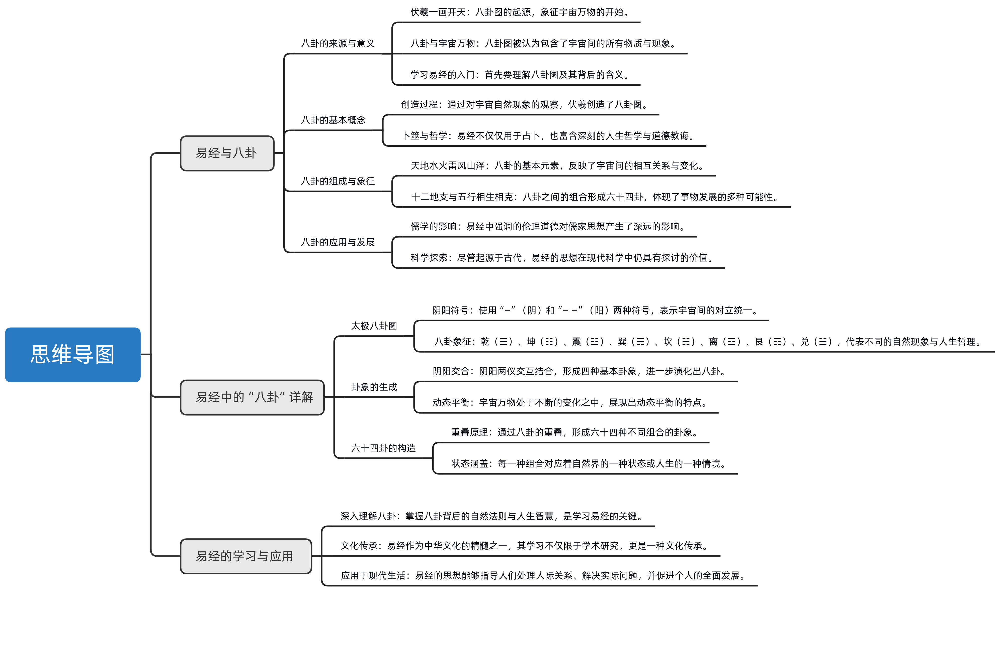

# 0、摘要

易经八卦，作为中华文明早期的重要象征，由伏羲创立，以简单符号展现复杂宇宙和社会法则，构成了易经的基础。

它通过八卦的变化反映出事物的动态平衡和发展过程，强调阴阳相互作用的重要性。

易经源于对自然界万物的深刻观察和归纳，总结出八种基本元素：天地、水火、雷风、山泽，这些元素相互作用构成了丰富多彩的世界。

八卦图的核心思想是通过这八种元素及其相互关系表达出来的，教导人们理解生活的本质，并通过自我调整提升个人品德。

易经的学习不仅是对古代哲学的探索，也是对自然界和人类社会深刻理解的过程。

八卦图是中华民族在没有文字以前最早的文明记载，学习易经首先就是要搞懂八卦图，那么八卦图是怎么产生的这八个卦象又分别代表着什么意思？为什么说宇宙万物全部包括在这八个卦象之中了？是否能有什么好办法可以使我们轻松的搞懂八卦图呢？台湾师范大学曾仕强教授将引领我们一起感悟易经的智慧，请继续关注八卦定乾坤。
我们没有宗教，但是我们有信仰。中国人的信仰在哪里？伏羲是当年。他的用意是要让我们中华民族生生世世有一个共同的认识，有一个共同的信仰。就是伦理道德。所以我们今天讲一句话，各位可以好好去想一下我们的列祖列宗，我们长期以来，我们那个永远没有断的东西就是伦理道德。所以为什么儒家那么受到重视，也就是这个道理。
可是在伏羲氏当年，他哪有文字，他哪里有语言？他怎么可能讲很多道理？不可能。这也是我们非常敬佩伏羲氏的地方。他就用简单的一画开天来告诉我们，太极一方面代表了宇宙自然的秩序，它是有规律的。可是夫妻是希望我们把自然的规律转移到人事社会上面，所以易经多半是经由宇宙万象来讲述人生的道理。
人生的道理是什么？我们用伦理，伦理是我们加上去的代名词。所以伦理你要跟西方人去讲，他就告诉你那就是宗教。因为西方人是把个人的道德修养是归于宗教的。我想这点我们一定要搞清楚，西方到最后是分的，做事是科学，做人是宗教，抽根是不分的。
所以他这个一画开天，他慢慢就分阴分阳。然后他就想，你管是有阴有阳，如果两个不互动的话，那有什么作用呢？那不能发生作用，所以他就知道阳一定会跟阴会化合在一起，这样才会产生万物，所以就变成什么？变成四象。
然后复习4，他又想，你老是阴阳这么平衡，它不会动，你看平衡怎么会动呢？所以他一想，宇宙是由不平衡所造成的，这个观念是影响我们太大了，一切都是不平衡。然后我们希望他平衡很快，又打破平衡，又找到不平衡，又来平衡，这个叫做动态的平衡。你用这个观念去看，所有现在的现象都是动态的平衡，不是静态的平衡。静态的平衡就叫静止，静止就是死亡，他不能动了，哪里会生生不息。因此他就知道两个音它上面可以加一个人，可以加一个阳，两个阳上面可以加一个阳，加个阴本来就是阴阳，也可以加一个阳或者加一个阴，这么一来就很自然变成八个，就叫八卦。六十四卦也是八卦，很多人认为是八卦就八卦，六十四卦就六十卦，没有那回事，六十四卦就是八卦，彼此这样子重合起来，配合到最后一共就有64种状况，这样就非常节制。
伏羲一画开天地，这一画就是太极，太极里面又包含着阴和阳，伏羲把阴和阳的几种变化画出来，就形成了八卦，但是很多人都觉得学习易经非常难，就是因为搞不懂八卦，更不用说六十四卦了。那么八卦究竟代表了什么？是不是掌握了八卦就可以读懂易经了呢？
读易经怎么读你先把八个卦搞清楚，所有的事情都离不开这八卦。所以八卦就是易经，易经就是八卦，连起来就叫易经八卦。八卦是什么？就是我们从宇宙万象里面，我们归纳出8种基本的元素，宇宙构成的元素。我们从易经里面得到的信息是说有8种，哪8种？就是跟我们人类生活最息息相关的8种。
第一种一定是甜的。老蒋没有天，那什么都没有了，一片寂静，动植物都没有，那成什么世界有了天，我们一抬头看到了，我们一低头马上会看到底下，那底下是什么地呢？所以天地这两个我相信没有人会离开的。人一旦离开天地，当然可以，偶尔做做航天人很荣耀，非常好。如果让你从此离开地球，你就做永远做个航天人，你愿意吗？我不知道，想想还是地球好啊。天地是我们人的根本离不开的。
天地之后你马上想到什么？反正想到两样东西是一根火。你没有水你活得了吗？你没有火你吃什么？你看你这样去想你就非常清楚说易经来就是从自然里面去把它萃取出来的一些道理。所以天地水火就是四个最根本的东西，天地水火就满足了吗？
没有，有时候火太大了很热，我们就开始什么扇扇子，就是西方风来了，可见蜂蜜很重要。这个风来了以后，你马上会想到跟风相对的是什么？就是雷打雷的时候那种感觉，跟风来的时候那感觉经常是对。
所以天地水火雷锋，那你会想到这个风为什么从那边进来？为什么不从这边进来？你看原来山挡住三会挡住很多东西，怪不得风从那边来。所以山又变得很重要，山挡住风，那风从哪里来？那边是什么？那就是海。也不一定完全是海。你看很多地方他没有海，就把这叫做海。像云南，云南说海子，海子就是一个福，一个则一个寒。
这样八样东西就出来了，天地水火、雷风山泽，所有世界上的事情都是这八种东西彼此互动。你看雷跟风互动，雷跟山互动，你也跟可以跟天赋通，怎么不给呢？一个雷可能倒到天上去，一个人可能从地下蹦一下跑出来。所以我们就把这八种现象定位八个经卦，就是基本卦。而且这里面它只分成两个小系统，一个就是跟天有关系的，一个跟地有关系的，所以非常容易记。
吴希是通过认真观察发现宇宙虽然有着万物万象，但都是由八个最基本的元素所构成的这就是天地、水火、雷锋、山泽。那么伏羲是怎样利用阴和阳这两个符号的变化组合来代表着八种自然现象的呢？
你看我们怎么画天，各位一定要从很远的古老的人类，他们很单纯的思维来想象他怎么花田很自然，我们就画了这么一条弧线，就是天。而且你会发现天不是薄薄的一层，好像天外有天，天上有天，这很容易了解。这句话三条像今天画彩虹一样的那个挂着出来的卦象，卦象就是这个卦象，什么像什么像天啊，天就这个样子。那地地在天底下，你看到天边有地，那个天边也有地，可是当中它有河流隔开来。你站在河流这边你会发现，那边有天这边有天，这个天是连在一起的。可是土地它是分裂的，所以这边一块那边一块，那很自然它就化成一个断掉的一个直线。你也知道土也是蛮厚的，也不是薄薄的一层，所以用散化断掉的子线。
我们把八卦分成两类，一类是跟天有关系的，一类跟地有关系的。你看你把天画下来，然后你会发现这三条直线按照我们现在的了解，其实这个也是从以前传下来的，就叫上东西，个人怎么分呢？尧这个字是易经里面独特的一个用语，就是他每一画都叫一个窑，最底下这一画就叫下游，当中那一话叫中游，最上面那一条就叫上游。尧就是一个符号，天最底下那也要动，就叫做天底下动天当中那摇动就叫天空中动天上面那窑洞就叫做天上面动，这非常清楚的那为什么用总数来代表动呢？
因为物以稀为贵，两个阳一个阴的阴是少数，所以以阴为主，两个阴一个阳，那阳是少数，所以阳为主。天下面动是什么？天下面有什么东西在动？马上有人想到树木，也没有错，天底下动的那些树木，那时候树木最高了，但是人会想到树木洞吗？而且树木万一那个地方没有树木呢？也有地方没有树木呢？
所以更普遍的，更容易想象的就是风来了。风来的就是天底下有一个东西我们是看不见，但是很明显感觉出来它是在动。天底下动风。天空中动那就容易的，只要有一个地方火烧，我们在天空中就看到一片火焰，一片火海。就算是小小的河，它也一定有烟，所以天空中洞就是火了。
那天上面动，这就比较麻烦了，因为以前也没有直升机，也没有卫星。你怎么看得到天上面是什么？这人类聪明就在这里。有一天你在池塘里面一看，你就发现怎么天空跑到底下去了，为什么我的倒影好像在上面呢？大家就知道了，池塘就是天上面动。
你看这三个东西都跟天有关系，天就是三画直直的，没有断掉的连续的那就叫天天下面动。风就是上面两个连续的，下面一个是变动的，他动就是天底下动逢。天空中的火天上面动着，很快就记住了。地也是一样，地是三条断掉的线，这三条断掉的线也是分成下中上地底下到什么倒霉。打的我们都感觉到，地底下有东西在动地当中，洞就是我们刚才讲到的水。水就是在地当中一直不停的流动。到第三面动，嘿第三面动跟天上面动同样发一点想象力，地上面很多很多东西，你说牛在动也对，狗在动也对，我们人在动也对。但是这些都是枝枝节节的现象。各位有没有发现，易经把我们的思维不断的提高，提高到去找到根本的东西，地上面最大的洞就是山。这样一来，我们就知道雷、水、山是跟地有关系的那加起来就是八卦。
八卦看起来复杂，其实只要明白它是怎么产生的，也就很简单了。三个阳爻代表天，天下动是风天中间动是祸，天上面动是泽。三个阴爻代表地，地下面都是雷地中间都是水地上面都是山。
学术界对八卦的由来有很多解释，在这里，曾教授阐述了他对八卦产生的个人理解。但是我们看到的八卦图上面写的并不是天地风雷、水火山泽，而是乾坤俊震、坎离艮对，这是为什么呢？曾教授也有一番新的见解。
天地水火，雷风山泽，那这样就能够了解宇宙人生的一切吗？好像也不能。所以我们慢慢的把天叫做钱，把地叫做坤。这个乾坤两个字，我们现在用的是太多了。我们可以说乾坤定义就是说这个天地他已经定位了，我们可以说颠倒乾坤就表示乱了套了。用我们用这种词汇里面还有乾坤的相当之多。可见天他用钱来代表D用N来代表。
我现在已经很熟悉了，乾坤就是天地。可是我们要想想看，你天不可以用其他来代表吗？一定要用钱呢？我们从易经里面可以很清楚的看到天天他到底代表着什么？我想这是经过一个长期的思索才得到的答案，代表刚健，不但干而且要贱。我不但说我很刚强，而且还要很久一阵子，刚想马上冷落下来就算天了。所以刚是刚见是见，刚是很刚强。剑是经得起考验，经得起时间的折磨，然后他有一种持久的意思，所以刚健的意思就是很久的刚强。
你看天不管你怎么样，他一年又一年的，他始终就是那个样子。没有哪天天舟，算了算了，我很疲倦的，我今天要休息的让人累，过周昏天黑地的日子。没有。所以我们就了解宇宙间有一种很刚健的这种性能，我们就用千来代表。
坤大家想了半天，坤是什么？柔顺，坤是非常柔顺。你看徒弟你高兴挖个洞他就让你挖。你归心山上对个头，对他就让你对你把那个动物的尸体埋进去，他也不抗议，各式各样的植物都从里面长起来，他都很关心。天他很刚，他很贱，地它很柔，它很顺。你看这两种一配合起来，你就知道这个天地实在是人类生存的好地方。
那风风也是两个性质，一个风吹出来的时候，它是无孔不入的。你看风一抬全身都感觉的，你只要有一个地方露出来，他马上就能灌进去。所以第一个他是入，而且他很奇。所以我们就用一个字来代表它，叫做你信这个字，就是他很急，他又很入，不是表面。雷雷给我们最大的感觉就是它是震动。你看打雷一来静音漏掉。
所以我们就把它叫做正。乾坤正讯。那水跟火呢？水尤其是我们中国人，我们又喜欢谁又怕谁，水一来就泛滥成灾。虽然最大的问题就是把泥土冲开了，冲掉了。所以你看那个坎，他就是欠土，凡是嵌土的地方都是被水冲过的，所以我们把水叫做坎。
代表8种元素的卦象之所以在八卦中被重新命名，一方面是因为这种元素本身的自然属性，比如天罡地柔、雷震风云，另一方面也揭示出自然现象与人类社会的相同之处。水被称为坎，就表现出水。就像我们生活中的坎坷一样，你怕他，但又不可能离开，只能面对它。那么火和山泽的命名又能给我们什么启发呢？
那火好啊，回忆起来以后很多人都跑去看了，因为她很美丽的。但是我们再看深一点，我们就知道烧到最后是同归于尽的。那个火的特性就是说他很能烧人家，他烧完把人家都烧光光以后，他自己也没有。所以我们才用你，你就是到最后你自己也不见了。你看我们现在救火还是用离的方法，这片火实在太旺，怎么救也救不了，我们就把四面打通隔绝的。让它烧，看你能烧到什么时候。当你把这边都烧光了，你烧不出去，你就灭了，那就叫篱笆。
三三在我们所能看到的自然现象里面，它是唯一停止的东西。而且我们人一走到山一看，这么高我怎么过得去呢？休息一下，暂停。所以他有子的意思也就是告诉我们，你欲望太多其实也不好，你稍微把自己做到一个合理的要求，适可而止，你才是好的修养，所以艮卦其实跟修养有很大的关系。
一个有智慧的人看到山了，总觉得我有需要把它征服吗？我一定要爬过去呢，我就在这里不好吗？而且你征服了这个山，你会发现还有更高的山，那你们累死自己。像这些都是历代慢慢加以扩充，加以发挥的东西。但是当初定这个字的时候，的确是一针见血，抓到根本，这是我们非常佩服的地方。跟就是止停止，它是停止，不是永远的停止。世界上没有永远停止的东西。你指一下休息是为了走更长的路。
最后一个叫做折，这为什么叫做？对，你看对旁边如果加上一个数星盘的话，它就叫做喜悦。你看到止水的时候，你的心情是很喜悦的，所以我们把它叫做对你这样一来我们就知道了这八个基本卦你们非常容易了解，而且真的跟我们生活息息相关。你再怎么绞尽脑汁想要想第九种、第十种，我看都很难。所以我们就把这八个基本卦画成八卦图，我们的亭子也做成八卦亭，就是告诉我们我们是生活在这八种基本元素当中，我们自己怎么样去调试，调试什么使我们品德越来越高尚。这样你就完全了解易经，其他的都是从这里衍生出来的。
八卦流传已久，是学习易经的基础。以上是曾仕强教授在多年的易经研究之后产生的理解。早在宋朝，大哲学家朱熹所著周易本义中的八卦曲线歌，就是对这八个基本卦的描述。这首词生动形象，朗朗上口。
前三连。流过。
这怎样育儿歌？你。
看中。
你上去。
伏羲一画开天地，代表了宇宙万物的起源，又以八卦定乾坤，把宇宙中所有的物质归纳为八种基本的元素，但是随着现代科学的发展，我们逐渐的发现，世间万物如此繁多，人类社会复杂多变，朱熹在几千年前所画的八卦图真的就能包括宇宙的一切吗？
整部易经就讲这两个字，八卦。六十四卦也是八卦。很多人不相信了，一斤只有64卦就能统合全球的东西吗？有那么容易吗？我们再想想看，64卦每个卦有六个爻，6乘64就384个羊，所以64它又变成384。而且每一个窑跟每个窑的洞换来换去，牵一发动全身，这在易经里面随时可以看得到。一个卦里面有六个爻，随便哪个爻一改变，它又变成另外一个卦了。我们常常讲又变卦了，又变卦了，就表示说他经常在变。有有变动的意思，也有仿效的意思。
八卦图是中华民族在没有文字以前最早的文明记载，学习易经首先就是要搞懂八卦图，那么八卦图是怎么产生的这八个卦象又分别代表着什么意思？为什么说宇宙万物全部包括在这八个卦象之中了？是否能有什么好办法可以使我们轻松的搞懂八卦图呢？台湾师范大学曾仕强教授将引领我们一起感悟易经的智慧，请继续关注八卦定乾坤。
我们没有宗教，但是我们有信仰。中国人的信仰在哪里？伏羲是当年。他的用意是要让我们中华民族生生世世有一个共同的认识，有一个共同的信仰。就是伦理道德。所以我们今天讲一句话，各位可以好好去想一想，我们的列祖列宗，我们长期以来，我们那个永远没有断的东西就是伦理道德。所以为什么儒家那么受到重视，也就是这个道理。
可是在伏羲氏当年，他哪有文字，他哪里有语言，他怎么可能讲很多道理？不可能。这也是我们非常敬佩伏羲氏的地方。他就用简单的一画开天来告诉我们，太极一方面代表了宇宙自然的秩序，它是有规律的。可是夫妻是希望我们把自然的规律转移到人事社会上面，所以易经多半是经由宇宙万象来讲述人生的道理。
人生的道理是什么？我们用伦理，伦理是我们加上去的代名词。所以伦理你要跟西方人去讲，他就告诉你那就是宗教。因为西方人是把个人的道德修养是归于宗教的。
我想这点我们一定要搞清楚，西方到最后是分的，做事是科学，做人是宗教，抽根是不分的。所以他这个一画开天，他慢慢就分阴分阳。然后他就想，你管是有阴有阳，如果两个不互动的话，那有什么作用呢？那不能发生作用，所以他就知道阳一定会跟阴会化合在一起，这样才会产生万物，所以就变成什么？变成四象。
然后复习4，他又想，你老是阴阳这么平衡，它不会动，你看平衡怎么会动呢？所以他一想，宇宙是由不平衡所造成的，这个观念是影响我们太大了，一切都是不平衡。然后我们希望他平衡很快，又打破平衡，又找到不平衡，又来平衡，这个叫做动态的平衡。你用这个观念去看，所有现在的现象都是动态的平衡，不是静态的平衡。静态的平衡就叫静止，静止就是死亡，他不能动了，哪里会生生不息。因此他就知道两个阴它上面可以加一个音，可以加一个阳，两个阳上面可以加一个阳，加个阴本来就是阴阳，也可以加一个阳或者加一个阴，这么一来就很自然变成八个，就叫八卦。六十四卦也是八卦，很多人认为是八卦就是八卦，六十四卦没有那回事，六十四卦就是八卦，彼此这样子重合起来，配合到最后一共就有64种状况，这样就非常节制。
伏羲一画开天地，这一画就是太极，太极里面又包含着阴和阳，伏羲把阴和阳的几种变化画出来，就形成了八卦，但是很多人都觉得学习易经非常难，就是因为搞不懂八卦，更不用说六十四卦了。那么八卦究竟代表了什么？是不是掌握了八卦就可以读懂易经了呢？
读易经怎么读你先把八个卦搞清楚，所有的事情都离不开这八卦。所以八卦就是易经，易经就是八卦，连起来就叫易经八卦。八卦是什么？就是我们从宇宙万象里面，我们归纳出8种基本的元素，宇宙构成的元素。我们从易经里面得到的信息是说有8种，哪8种？就是跟我们人类生活最息息相关的8种。
第一种一定是甜的。老蒋没有天，那什么都没有了，一片寂静，动植物都没有，那成什么时间有了天，我们一抬头看到了，我们一低头马上会看到底下，那底下是什么地呢？所以天地这两个我相信没有人会离开的。人一旦离开天地，当然可以，偶尔做做航天人很荣耀，非常好。如果让你从此离开地球，你就做永远做个航天人，你愿意吗？我不知道，想想还是地球好啊。天地是我们人的根本离不开的。
天地之后你马上想到什么？反正想到两样东西是一根火。你没有水你活得了吗？你没有火你吃什么？你看你这样去想你就非常清楚说易本来就是从自然里面去把它萃取出来的一些道理。所以天地水火就是四个最根本的东西，天地水火就满足了吗？
没有，有时候火太大了很热，我们就开始什么扇扇子，就是西方风来了，可见蜂蜜很重要。这个风来了以后，你马上会想到跟风相对的是什么？就是雷打雷的时候那种感觉，跟风来的时候那感觉经常是对的。
所以天地水火雷锋，那你会想到这个风为什么从那边进来？为什么不从这边进来？你看原来山挡住三会挡住很多东西，怪不得风从那边来。所以山又变得很重要，山挡住风，那风从哪里来？那边是什么？那就是海。也不一定完全是海。你看很多地方他没有坏，就把这叫做海。像云南，云南说海子，海子就是一个福，一个哲一个海。
这样八样东西就出来了，天地水火、雷风山泽，所有世界上的事情都是这八种东西彼此互动。你看雷跟风互动，雷跟山互动，你也跟可以跟田富通怎么不给呢？一个雷可能倒到天上去，一个人可能从地下蹦一下跑出来。所以我们就把这八种现象定位八个经卦，就是基本卦。而且这里面它只分成两个小系统，一个就是跟天有关系的，一个跟地有关系的，所以非常容易记。
伏羲氏通过认真观察发现宇宙虽然有着万物万象，但都是由八个最基本元素所构成的这就是天地、水、雷锋、山泽。那么伏羲是怎样利用阴和阳这两个符号的变化组合来代表着八种自然现象的呢？
你看我们怎么画天，各位一定要从很远的古老的人类，他们很单纯的思维来想象他怎么画天。很自然我们就画了这么一条弧线，就是天。而且你会发现天不是薄薄的一层，好像天外有天，天上有天。这很容易了解了这句话，三条像今天画彩虹一样的那个挂机出来的卦象，卦象就是这个卦象，什么像什么像天啊，天就这个样子。那地地在天底下，你看到天边有地，那个天边也有地，可是当中它有河流隔开来。你站在河流这边你会发现，那边有天这边有天，这个天是连在一起的。可是土地它是分裂的，所以这边一块那边一块，那很自然它就化成一个断掉的一个直线，你也知道土也是蛮厚的，也不是薄薄的一层，所以用三化断掉的直线。
我们把八卦分成两类，一类是跟天有关系的，一类跟地有关系的。你看你把天画下来，然后你会发现这三条直线。按照我们现在的了解，其实这个也是从以前传下来的，就叫上东西，不然怎么分呢？有这个字，是易经里面独特的一个用语，就是他每一画都叫一个窑，最底下这一画就叫下游，当中那一话叫中游，最上面那一条就叫上游。尧就是一个符号。天最底下那也要动，就叫做天底下动天当中那摇动就叫天空中动天，上面那窑洞就叫做天上面动，这非常清楚的那为什么用总数来代表动呢？
因为物以稀为贵，两个阳一个阴，那阴是少数，所以以阴为主。两个阴一个阳，那阳是少数，所以阳为主。天下面动是什么？天下面有什么东西在动？马上有人想到树木，也没有错，天底下动的那些树木，那时候树木最高了，但是人会想到树木洞吗？而且树木万一那个地方没有树木呢？也有地方没有树木呢？
所以更普遍的，更容易想象的就是风来了。风来的就是天底下有一个东西我们是看不见，但是很明显感觉出来它是在动。天底下动风。天空中动那就容易的，只要有一个地方火烧，我们在天空中就看到一片火焰，一片火海。就算是小小的河，它也一定有烟，所以天空中动就是火了。
那天上面动，这就比较麻烦了，因为以前也没有直升机，也没有卫星。你怎么看得到天上面是什么？这人类聪明就在这里。有一天你在池塘里面一看，你就发现怎么天空跑到底下去了，为什么我的倒影好像在上面呢？大家就知道了，池塘就是天上面动。
你看这三个东西都跟天有关系，天就是三画直直的，没有断掉的连续的那就叫天天下面动。风就是上面两个连续的，下面一个是变动的，他动就是天底下动逢。天空中的火天上面动着，很快就记住了。地也是一样，地是三条断掉的线，这三条断掉的线也是分成下中上地底下到什么倒霉。打的我们都感觉到，地底下有东西在动地当中，洞就是我们刚才讲到的水。水就是在地当中一直不停的流动。
那地上面动呢？嘿地上面动跟天上面动同样发一点想象力。地上面很多很多东西，你说牛在动也对，狗在动也对，我们人在动也对，但是这些都是枝枝节节的现象。各位有没有发现，易经把我们的思维不断的提高，提高到去找到根本的东西。地上面最大的洞就是山。这样一来，我们就知道雷、水、山是跟地有关系的那加起来就是八卦。
八卦看起来复杂，其实只要明白它是怎么产生的，也就很简单了。三个阳爻代表天，天下动是风天中间动是祸，天上面动是泽。三个阴爻代表地，地下面都是雷地中间都是水底上面是山。
学术界对八卦的由来有很多解释，在这里，曾教授阐述了他对八卦产生的个人理解。但是我们看到的八卦图上面写的并不是天地风雷、水火山泽，而是乾坤俊震、坎离艮对，这是为什么呢？曾教授也有一番新的见解。
天地水火，雷风山泽，那这样就能够了解宇宙人生的一切吗？好像也不能。所以我们慢慢的把天叫做钱，把地叫做坤。这个乾坤两个字，我们现在用的是太多了。我们可以说乾坤定义就是说这个天地它已经定位了，我们可以说颠倒乾坤就表示乱了套了。用我们用这种词汇里面还有乾坤的相当之多。可见天他用钱来代表D用N来代表。
我们在已经很熟悉了乾坤，乾坤就是天地。可是我们要想想看，你天不可以用其他来代表吗？一定要用钱呢？我们从易经里面可以很清楚的看到天天他到底代表着什么？我想这是经过一个长期的思索才得到的答案，代表刚健，不但干而且要贱。我不但说我很刚强，而且还要很久一阵子，刚想马上冷落下来就算天了。所以刚是刚见是见，刚是很刚强。剑是经得起考验，经得起时间的折磨，然后他有一种持久的意思，所以刚健的意思就是很久的刚强。

