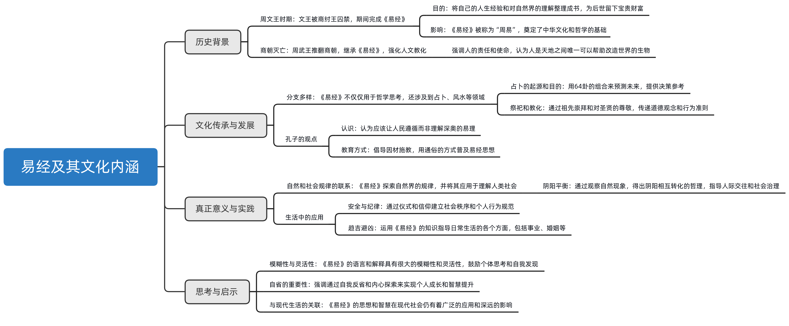

# 0、摘要

《易经》源于周文王对自然和社会的深刻洞察，是中华文化的重要组成部分，以其深奥的哲学思想和复杂的象征系统影响深远。

《易经》的发展经过了伏羲的八卦图到周文王的《周易》，再到孔子的应用和发展，体现了中华文化中对人文精神的重视和对传统智慧的尊重。

《易经》不仅仅是一部占卜工具，更是一种理解和应对世界的方法论，强调阴阳平衡和自然规律的重要性。

尽管现代社会对其有各种误解和滥用，《易经》的本质在于通过理解自然和社会规律来指导个人行为和社会进步。

它提倡自我反省和遵循自然法则，对中国的思维方式和生活方式有着深刻的影响。

 # 1、周易的由来及其文化影响
> 《易经》起源于周文王在狱中的深刻思考与创作，反映了其对自然和社会规律的洞察。
>
> 这部作品不仅因其深奥的哲学思想而备受尊崇，还因其复杂且富有变化的象征系统成为了占卜的重要工具。
>
> 尽管历经千年，《易经》的影响仍然深远，其背后的故事和智慧值得我们深入探索和理解。

周文王囚禁在狱中时完成了《易经》，因此《易经》也被称为《周易》。

文王著易，是因为感悟到人类社会的规律与大自然的规律有很多相通之处。

但是为什么《易经》从一诞生就被蒙生了一层神秘的色彩，甚至成为算命的工具呢？

穿越几千年的《易经》都经历过哪些坎坷的遭遇呢？

台湾师范大学曾仕强教授将引领我们一起感悟《易经》的智慧，请继续关注《易经》与命运。

曾志强：

有一段历史相信大家都很熟悉，就是商朝本来也是一个很好的朝代，但是传传传，传到商纣王的时候，我们都知道他的品性很差。

暴虐无道，做出很多老百姓非常不喜欢的事情，所以当时的老百姓反而比较欢迎周西伯，也就是周文王。

为什么他叫周西伯呢？

因为他是商朝封在西边的一个诸侯，周西伯很得民心，商纣王对他有点害怕，所以就假借一些理由把他抓起来，关在羑里。

周西伯被关的时候，他有两个想法。

一个是说，我有这么宝贵的人生经验，这是我长时间累积，自己亲身体验的东西，如果把它丢掉了实在是太可惜。

我不如利用这段时间，我把它整理出来，将来也许对世界人有一些贡献。

第二个想法就是说，纣王这个人，他是说杀就杀的，他不会念到什么以前的什么情面，他不会，尤其这是利害关系，因此他就知道，他是命在旦夕。

商纣王叫人把周西伯的儿子做剁成肉酱，做成肉包给他吃的时候，实际上他也知道这就是自己儿子的肉所包成的东西，但是他还是吃了，他不是很残忍，他不是那么忍心去吃他儿子的肉，而是他为了顾全大局，我要保住这条命，我没有办法现在去跟他对抗，我现在发作出来，正好上他的当，所以呢，我就忍辱偷生，我非要把我的理想完成不可。

因此他就在牢里头开始写《易经》，替《易经》写一些经文。

所以后代有很多人，一被关到牢里面去就开始要写书。

就是跟周西伯，也就是后来的周文王学习的。

周西伯，他把他人生累积起来的宝贵经验，透过六十四卦，卦爻，卦有六个爻，而每个爻他都给它一些词句来说明，就成为今天的《易经》。

因为在伏羲当年他是没有文字的，那时候只有简单的符号，可以说是无字天书。

真正成为《易经》，是周文王，也就是周西伯，他在牢里头很费苦心，一个字一个字斟酌。

一方面它是受到纣王的压制，很难能够畅所欲言，有一点躲躲藏藏，有一点难言之隐，有一点说不出来的苦衷。

但是他也替我们创造了一个叫做**留白性**。我在字里行间我留了很多可以拐弯抹角的空间。

你看他写完以后，我相信很多人想改他。因为你只要能够改动他一个字，你就成名了。

但是怎么样也改不了，就算里面有很多这样解释，那样解释，搞不清楚的，大家都非常尊重周文王，所以他的经文大部分都传下来。

# 2、周易与人文精神：从伏羲八卦到孔子教化
> 伏羲创立的八卦图因其无文字阐释而被称为‘无字天书’，后经周文王演变为《周易》，通过赋予每一卦以名称和解释，并详尽阐明六十四卦之间的联系与意义，展现了《易经》的深邃哲理。
>
> 周文王及其子周武王强调人的特殊地位——作为能帮助天地改造世界的物种，体现了强烈的人文关怀与责任感。
>
> 孔子进一步发展了教化理念，提出应适当保留宗教仪式以促进民众道德修养，强调学习传统的重要性并尊敬先贤智慧。
>
> 这段对话反映了中华文化中《易经》、儒学对于人文精神的深刻影响及教育的目的在于启发民众的智慧和道德自觉。

伏羲八卦图因为没有文字而被称为无字天书，后世有许多人企图用文字对八卦图进行注解，但较为完整的流传至今的只有周文王所写的《易经》，所以我们常把《易经》也称为《周易》，那么周文王是怎样对伏羲八卦进行文字注解的呢？

他每个卦给它一个卦名，然后给他一个卦词来解释这个卦名。

每个卦有六个爻，他每个爻都很费心的把它注解，给它一些爻词。

六十四卦下来，居然完整无缝，环环相扣，没有矛盾，而且可以互补，真是非常的难得。

后来周朝推翻了商朝，周武王他就讲出一句话，他说：**人为万物之灵**。

他讲这句话其实是有很重的使命感。

因为他知道他的父亲，也就是周文王，把《易经》写完下来，主要是为了教化。

但是在当时明智未开，而且商朝是一个非常迷信的时代，你要一下子破除迷信几乎是不可能的。

因此他先把这个《易经》的宗旨写出来，讲出来，所以一直传到现在，我们都知道有这句话，叫做人为万物之灵，只是很多人搞不清楚这句话到底是谁说的。

为什么要说？搞不清楚？

就是人，他本来是动物的一种，但是既然身为人，你就要觉悟，我要拉开跟动物的距离。

因为什么？

因为《易经》告诉我们，人是天地之间唯一能够帮忙天地来改造这个世界的一种动物，这是我们的责任。

文王这一部古经，他是为了教化用的。

但是在商朝这个时代，迷信那么浓厚的时候，所以周文王才会用卜筮的词句，用卜筮的形式来写爻辞。

有吉、凶、悔、吝、无咎，这些话，替《易经》披上一件神秘的外衣。

孔子说，民可使由之，不可使知之。

其实也在讲这件事情。

他说，老百姓你要他能够完全听懂道理恐怕有点困难。

我想在当时，孔子会有教无类，会那么用心的到处去普施教化，他就是看到老百姓多半知识不普及，智慧未开，你要他听懂道理相当困难。

因此他采用其他的方法，其中有一个方法是我们非常普遍，而且一直种到现在的，叫做祭祀，拜祖宗。

而且历代的皇帝没有一个不祭祀，没有一个不拜祖宗。

孔子他说祭如神在，你要么不祭，你可以不祭，我尊重你，你如果要祭的话，你心中就有神的存在，这就是儒家非常重视的那个“敬”字。

我常常感觉到，我们现在要来了解中华文化，要来了解《易经》，这个“敬”字非常重要。

# 3、全球尊敬孔子及其哲学：《易经》的神秘与幸运
> 孔子受到世界各地人们的高度尊敬，其思想深远影响着教育和文化。
>
> 《易经》作为一部包含中华文明大智慧的经典作品，虽然被蒙上了神秘的面纱，但在历史上却因其特殊地位而幸免于难，成为了重要的文化遗产。

一看中国话，还是落伍了，就该丢掉了，那你永远也学不会了。

一看《易经》说，这有什么用？那么旧的东西，那你永远学不会。

我们要恭敬，为什么？因为这是老祖宗留下来的宝贵的智慧。

其实全世界的人都很重视，大家对孔子都是非常恭敬的。你到韩国去看看，韩国的学校门口就是孔子的像。

韩国的师生每天要上学，先对孔子像鞠个躬，然后才进去。

其实欧洲也好，美国也好，很多人听到孔子都是竖起大拇指，了不起。

我们不能因为说我们对他太熟悉了，所以就加以轻视。

孔子要我们敬畏大人，敬畏圣人，不是害怕他什么，而是你要敬重他，你才能从他当中学到一些道理。

《易经》很不幸的披上了一个神秘的外衣。

但是你如果从一阴一阳之谓道，你也会觉得，那真是太幸运了。

怎么一会说不幸运，一会说幸运呢？

周文王在狱中写《易经》，为了避免商纣王的迫害，很多话不好明言，只能用吉、凶、悔、吝等卦辞来解释自然与社会的普遍规律。

结果使《易经》这部包含着中华文明大智慧的书，从一诞生起，就被蒙上了一层神秘的色彩。

但为什么又说这是一种幸运呢？

你看秦始皇要烧所有的书的时候，人家就告诉他，说《易经》这本书不必烧。

他说为什么不被烧？

因为那是卜筮的书，那是占卜用的。那搞迷信的，民间使用的东西。

可见《易经》用来占卜，是盛行了很长时间。

所以秦始皇要烧的时候啊，他一听这种书留给老百姓用啊，不要烧。

《易经》因为本身的神秘，所以逃过了秦火，以至于很多人说，你看《易经》真神了，连自己有这一劫他都算好了，他都事先能够防备。

我想这个也不必这么把它神化，因为秦始皇他总要留一些东西给老百姓，他所要烧的，是那些读书人读的东西，他有他的用意。

# 4、《易经》与民间信仰：理解与应用的差异

> 《易经》被分为‘术数’和‘易理’后失去了和谐的精神，强调阴阳平衡的重要性。
>
> 尽管实数被视为迷信，但民间流行的算命、看风水等实践却广受欢迎。
>
> 这些活动虽然基于《易经》，但却误解了其真正的精神。
>
> 许多人过分追求理性，忽视了生活的感性方面，导致无法有效运用《易经》的智慧解决实际问题。
>
> 实际上，《易经》的真正价值在于通过理解和应用其原理来指导生活，而不仅仅是追求表面的神秘效应。

秦朝以后，汉朝起来了，汉朝最大的问题，就是把《易经》分成两部分，一个叫术数，一个叫易理。

这基本上就已经违反了一阴一阳之谓道的精神。

因为《易经》它是讲和的，所有的分都是为了和。我想这句话非常重要。

太极可以是两仪，但是两仪怎么变来变去，最后还是回归太极的状态。

一个是静止的，一个是动的，动了静，静的动，这样才有变化。

我们为了研究方便，把《易经》分成易理，分成术数来研究，这个还无可厚非。

如果直截了当说，术数是迷信，只有易理才是对的，我想也是有一偏之见。

我认识一位学者，他一生就是主张只有易理。

他非常讨厌什么算命的，看风水，他认为那都是一派胡言。

可是很不幸的，这位先生最后也是自杀了。

可见一个人，完全讲道理，他就少一个情字，他就很少有同情心。

这个情理情理，它是合在一起的。

完全讲理，讲到最后，大家会发现有很多人他是过分理智了以后，他连自己的生活他都安排不了。

那讲术数就更可怕了，那真是《易经》的大不幸。

可是我们民间所流传的，极少是易理的，易理多半在读书人手上，读书人读了半天他又不会用，所以人家说你只会搞理论。

然后民间他所流行的都是什么，算命、看风水、选日子，甚至连姓名学，统统都搞在里面，他搞得红红火火很热闹。

你能说他们不对吗？你又能说他们对吗？

谁也不知道。

因为他们利用这种，说难听点就是一些花样，然后使外行人感觉到我很神秘，所以我讲出来就是对的。

他把《易经》推广的非常流行，以至于今天一听到《易经》，所以人都说那你会算命，你看糟糕不糟糕？

就好像把易理整个撇掉了。

实际上，读《易经》读到最后是要明白道理的。

你看今天我们一讲到八卦，马上就想到那是笑话，那就是什么，荒唐不羁，没有依据，扯来扯去，搞不清楚东西就叫八卦，这实在是愧对祖先了。

# 5、探索《易经》的真谛及其现实应用
> 《易经》源自对自然现象的观察，其目的在于通过理解自然规律应用于人类社会，促进个人自律和社会秩序。
>
> 借助于八卦和六十四卦的理论，《易经》揭示了事物相互关系的复杂性，并教导人们如何通过这些关系进行预测和决策。
>
> 尽管现代许多人将《易经》用于占卜，但其初衷远远超过了简单的命运预测，旨在提供一种理解和应对世界的方式。
>
> 通过日常生活的例子，如寺庙的门槛规则和尼姑的安全问题，阐述了《易经》思想在现实生活中的应用，旨在说明即便是最为常见的迷信背后也隐藏着深刻的道理和实用的价值。

伏羲氏根据对自然现象的观察，画出了八卦。

周文王发现人类社会的规律和大自然的规律是相通的，于是用六十四卦推演出世间的万物万象。

但是《易经》流传到现代社会，几乎成为了一种算命用的工具，那么《易经》的真正用意到底是什么呢？

《易经》他真正的用意，是希望我们透过我们对自然的观察，因为自然它有现象，我们眼睛看得到，全世界的人都在用眼睛看世界。

到今天还是。

这样看出来，各有心得，各有体会，然后再提出一些，其实所有的学说都是从假设性的开始，叫做**假说**。

我们用简单一句话，说抬头三尺有神明，来使得每一个人有所畏惧。

知道说我不能太放纵自己，我不能为了自己的需求而为所欲为。

那是为了什么？

为了安全、为了纪律、为了方便、为了有效。

你去旅游的时候，你听那些导游在告诉你这样那样。

我们进庙，他告诉你这个门槛是不能踩的。

当然不能踩，因为你人一踩搬上去头就碰到上面的门框了，那头破血流谁负责任？

可是你告诉他，说你不能踩，踩的会头破血流，他一百个不相信，不会啊，他就踩。

然后等到头破血流的时候，他埋怨你，这是人性。

所以我们就说你踩门槛，你会运气不好，大家怕了不敢踩，那就安全了。

不要踩门槛是为了安全，有门槛设计也是为了安全。

说那个寺庙大门不能开，只有皇帝来才能开。

我们想象看那个寺庙多半是在什么地方？多半是在野外、荒山、郊野。

那个地方最多的是什么？就是强盗。你强盗什么时候进来，官兵根本来不及来，那和尚要靠自己抵抗。

因此他就知道了，我如果装门一开，那强盗一下进来我挡都挡不住了。

所以我中门关闭了，前面有一条小桥，两边有两个河，今天叫做放生池，拿我这两个偏门一开，老远听到看到，我便关偏门，来得及。

安全有效方便。

你看到尼姑会倒霉了，这种迷信其实也是好意的，就是为了保护尼姑的安全。

很多人不了解，说太这种没有价值，怎么会没有价值？任何事情你用的合理它就有价值。

各位想想看，尼姑要不要出来办事，要不要出来买东西，要不要出来处理一些事情？

总要吧。

他一出来，外面只有两种男人，一种是农夫，一种是打猎的猎人。

因为一般人他不会住在尼姑庵附近的。

你尼姑一出来，两种男人，一个是农夫，一个是打猎的猎人。

这两种人的体力都比较壮。然后一看这个尼姑还觉得蛮漂亮的，那尼姑就倒霉了，他就不安全了。

所以我们就说，看到尼姑会倒霉，你赶快不要看。

那农夫一看尼姑，赶快不看，打猎人一看尼姑，赶快不去看，尼姑就很安全了。

你如果朝这方面去了解，你就知道一阴一阳之谓道，在我们中国人的社会里面，它是广为流传，而且普遍的在应用。

# 6、探索《易经》哲学与个人命运
> 《易经》旨在通过自然现象理解人类社会及自我反思。
>
> 佛的意义不仅是被崇拜的对象，更是教导人们达到觉悟和修行的目标。
>
> 真正的信仰应该是引导人们自我完善，而不是单纯依靠外在的仪式或祈求。
>
> 算命虽有一定的心理效应，但应理性对待，不应全然信从以致失去自主。
>
> 强调人本位的重要性，反对过度依赖神佛和迷信活动，鼓励通过自身努力实现命运的改善和社会的进步。

《易经》的真正用意，在于通过一些自然现象的规律来了解人类社会的规律，并反省自己的处境和应该如何应对，就像寺庙里的一些规矩，虽然看起来有些迷信的色彩，但实际上有利于人和社会的安全。

那么人的命运是不是可预测的呢？求神拜佛能改变一个人的命运吗？

我们动不动就要求神拜佛，这种现象是不了解的。

因为佛如果让你拜，他就会保佑你，那这个佛算什么佛呢？

佛在梵文里面，它的原意是教授。

你看释迦摩尼佛本来也是人啊，他说悟到道了以后，他就修成佛了。

他就告诉我们所有的人，只要你悟到道理，你又能够认真去做，你终究可以成佛。

菩萨是没有到成佛的，所以菩萨比较不能开口了，不太说话的，就说你问佛好了。

但是像观世音菩萨，像地藏王菩萨，那都具备了成佛的条件了。

他们两个是说我不成佛，我就是不成佛，为什么？

因为我要救世人，我必须成佛了。

成佛坐在那里让人家拜人家参，还不如我这个实际行动对世界人更有帮助。

所以地藏王菩萨他说，地域不空，我永远不成佛。

他知道地狱永远不会空的，他就愿意这样，那是不是比佛还伟大呢？

所以这种情况之下，我们要了解，我们求神拜佛只是提醒我们神明在那里，你不要胡作乱为，你要好好管管自己，要好好修炼自己的品性了，这就对了。

如果你送点礼品，你烧几个香，然后拜佛，佛就庇佑你们全家。

那个佛就是贪官污吏嘛，那不成佛了。

绝没有这个事情。

有人跟我讲，算命的很灵哦。他说我去算命，他说我会在一个海边然后安定下来，那里风光很美，我的工作很稳定。

我果然现在是这样，我说这是你受了他心里的暗示，然后全力去配合，你全国跑来跑去一看，嘿，这居然是海边。这个人不错，正好是他算准了，所以我就下来，就这么简单。

你如果不配合他他就不准，你配合他他就很准。

算命不是叫你听他的话的，你听他的话，那你变成什么？

变成他的奴隶了，他就变成你的主人了，他就可以控制你了，他就是你的主宰了。

那还得了。

算命是说你算算看，我听听看，如果对我有利的，我就尽量去达成，如果对我无利的那我尽量去避免。

这才是《易经》告诉我们趋吉避凶的大道理了。

有一个人听到他有血光之灾，他就觉得很搞笑。

我那一天就躲在家里，我就躺在床上，所有窗门都给我关起来，你看我有什么血光之灾。

结果他就躺在床上，没有想到外面能打弹弓，穿破玻璃窗，一下打到他头上的镜框，刚下来正好又是血光之灾。

然后你就说真灵啊，算得到，躲不过啊。

其实有那么严重吗？

我那一年，他告诉我有血光之灾，我就按照《易经》的道理，我就拒绝接受。

我说我不要让它发生，我不让它发生，我就很谨慎。有很多地方我一看不对劲，可见你相信不相信？

我们讲诚则灵，意思就是说你相信他，你就要接受他的摆布。你不相信他你就可以防备，防备到什么地步还是看你自己。

所以我们回到《易经》的人本位，这才是人类的尊严。

我们神庙很多，动不动就求神，动不动就拜鬼，那人的自主性跑哪里去了？

如果说那样就可以发财，就可以平安，那什么事也不要做了，那人类社会会进步吗？

# 7、探究《易经》的哲学与占卜：理解自然与人生的智慧

> 《易经》，作为中华文化的重要组成部分，其不仅具有深远的哲学意义，在指导中华文明发展方面起到了关键作用，同时也作为一种占卜工具被广泛使用。
>
> 通过对《易经》六十四卦的学习和解读，人们试图预测未来、趋吉避凶。
>
> 《易经》强调自我反省和遵循自然规律的重要性，认为通过理解和顺应这些规律，个体可以获得吉祥和避免不幸。
>
> 它的模糊性和灵活性赋予了人们极大的想象空间和应对复杂情境的能力，对中国人的思维方式和生活方式产生了深刻的影响。
>
> 尽管《易经》历经考验，遭遇诸多挑战，但它依然以其独特的魅力和智慧，引导人们面对生活的困难和挑战。

人们之所以去求神拜佛，之所以去算命，就是对无常的人生难以把握，希望能提前知道自己的命运，希望有什么神秘的力量来保佑自己避免灾祸。

《易经》中的六十四卦常见吉凶之辞，所以被许多人用来占卦算命，以保佑自己趋吉避凶，这么掌握了《易经》真的能够趋吉避凶吗？

《易经》那句话我们重复好几遍，叫做**自天佑之，吉无不利**。就是你自己去了解天理，然后你又顺从自然，你就会得到吉祥，你就不会有什么不利的后果。

所以这种情况之下，我们所重在人，在自己。我没有悟到天理，我有没有去悟到自然的道理。

其实《易经》就是把自然的规律，把它转移到人事方面的伦理。

所以伦理从哪里来？

从自然来。

自然那么有秩序，是谁在管呢？

如果伏羲是当年说神在管，那我们就产生宗教了。

他说没有，就是阴阳的互动，它是自然的孕育，并没有什么特殊的主宰。没有。

我们现在从物理学上大概可以了解到，《易经》其实是比较接近真理的。

就是说它有两种不同的力，这样子交互的去作用，很自然就产生万物，而且它会不断的运行。

《易经》它怎么能够那么神？

你看我们用一个神字就表达，它很神奇，它很神秘，它很高明，如此而已。

因为它有三个特性，我们必须要说一下，他超越了所有什么神学、哲学、科学，它涵盖了那么多东西，是因为他有这三个特性。

1、模糊性

2、灵活性

3、空白性

第一个是说起来真的是外国人所讲的，很好笑，他是**模糊性**。

他很模糊，因为就那么一个几个系统，就几个花样，几个符号，其他都没有了，给你很大的想象空间。

你怎么想他都有道理，因为它简单明了，才能够作用那么大。

他这个模糊性影响了中国人很深。

你看我们讲话，经常不喜欢讲的非常清楚，我们经常不喜欢，我们都是点到为止。

第二个，《易经》有很大的**灵活性**。

你看周文王所写的东西，我们这样解释一下对，那样解释也对。所以它非常灵活。

说难听一点，怎么讲怎么对，怎么讲怎么不对。

对的里面有一些不对，不对的里面有一些对，这个对我们中国影响太大了。

各位真的要花点心思去想想。

西方人`right is right，wrong is wrong`, 不可能说对里有错，错里有对，他不可能。

我们不是，因为他是分的，对、错，中国人没有，中国人知道，绝对对的部分太少了，圣人有时候也会犯错，神仙打鼓有时候也会打错的，绝对错的人太少。

所以我们就有四个字叫做**慎断是非**，是非要圣断。而不是明断。

我们今天很喜欢用明断是非，很难，慎断是非。

我们还有一个更妙的，叫做**空白性**。

你看西方人画画，他一定全张都要涂的满满的，否则就是未完成的作品。

中国哪里有？中国人一张？这里画一只鸟，这里画一朵花，那边点点点，说下雨，来盖个图章，来签个名，他留下很多空白。

我们认为这个画家尊重看的人，他尊重我们看的人。

你看一张画他的意境是怎么样？

十个人来看十个不一样，我们才是符合自然的。

这样一来，我们就慢慢更深一层的去了解《易经》，以及他对我们中国人的影响。

可是这套学问，在很早很早以前，明智未开，知识不普及，你这样讲谁听得懂，听不懂。

所以《易经》本身的命运也是很坎坷，跟《易经》里面所讲的，不断的出现险阻，不断的出现艰难是一样的道理。

艰难险阻，不是很艰难，就是很危险，就是受到阻碍。

这样好不好？

看起来不好，实际上这样才是好的。

因为这样，你才能够学习，才能够磨练，才能够增进自己。

一个人从小到死都很顺，他等于白活了。

他来这一趟干什么？

他只学会四个字，吃喝玩乐，什么都没有，那这算什么人生。

所以人生，经过更多的磨练，你才会更成熟。

《易经》本身也是经过磨练的。

《易经》共有六十四卦，代表着宇宙中的六十四种情景。

占卦其实就是一种定位的手段。

那么我们应该如何了解卦象，明白其中的道理呢？

《易经》作为中华文化的群经之始，一方面从哲学的角度指导着中华文明几千年的发展，另一方面《易经》的占卜功能始终神神秘秘，隐隐约约。

那么《易经》的占卜到底有多大的精准性？

孔子又是如何评价《易经》的占卜功能的呢？

我们怎样才能读到属于自己的那一卦呢？

