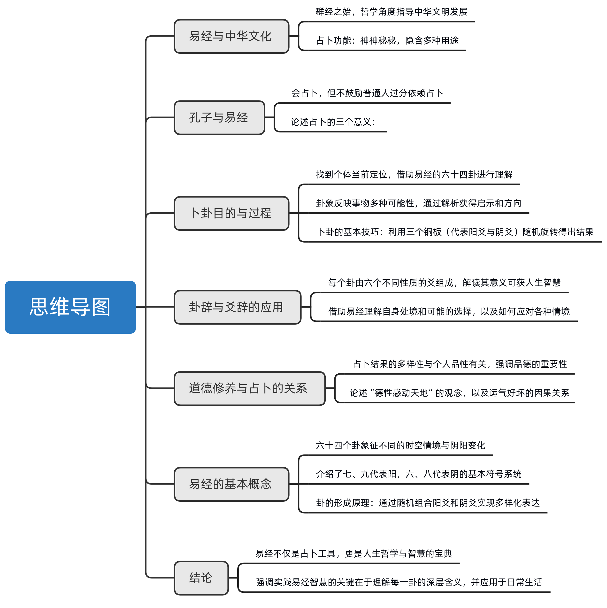

# 0、摘要

《易经》，作为中华文化的核心部分，不仅在哲学领域指导了中华文明的发展，还在占卜方面保持着神秘色彩。

孔子对《易经》的态度复杂，虽精通道学，但也警告人们不宜过度依赖占卜，强调应通过占卜理解事物本质而非仅求预测结果。

他批评了占卜中的欺骗行为和人们的盲目崇拜，但也不反对适当使用《易经》进行自我反省和决策辅助。

《易经》的占卜方法帮助人们在面临困境时找到解决问题的途径，通过将自身处境与《易经》的六四种情景相比较，实现更好的自我认知和决策能力。

此外，《易经》哲学强调个人品德对于改变命运的重要性，以及在医疗、治疗等领域道德修养的应用。

通过简单数学原理，《易经》展示了数字变化的深层哲理，从而教导人们如何在生活中应用《易经》的智慧。

正确理解《易经》，需要避免迷信思想，而是通过自我实践深入领悟其丰富的人生哲理和实用价值。

# 1、探索《易经》：占卜、哲学与个人启示

> 《易经》，作为中华文化的重要组成部分，不仅在哲学上引导了中华文明的发展，其占卜功能也一直保持着神秘色彩。
>
> 孔子对《易经》的态度复杂，虽然他本人精通占卜，但却不建议普通人过分依赖占卜，强调占卜不应成为决策的唯一依据。
>
> 孔子认为，真正的智慧在于通过占卜理解事物的本质，而不是单纯追求预测结果。
>
> 此外，他也批评了占卜中可能存在的欺骗行为和人们对其的盲目崇拜。
>
> 尽管如此，孔子并不反对使用《易经》进行自我反思和决策辅助，而是鼓励个人通过实践占卜来深入理解和运用《易经》的智慧。
>
> 这种做法能够帮助人们更好地认识自己和周围的世界，从而做出更加合理的决策。

《易经》作为中华文化的群经之始，一方面从哲学的角度指导着中华文明几千年的发展，另一方面《易经》的占卜功能始终神神秘秘，隐隐约约。

那么《易经》的占卜到底有多大的精准性？

孔子又是如何评价《易经》的占卜功能的呢？

我们怎样才能卜到属于自己的那一卦呢？

台湾师范大学曾仕强教授将引领我们一起领悟《易经》的智慧，敬请关注破解占卦。

《易经》的占卜功能从它诞生的那一天起就神神秘秘，隐隐约约。如果我们在生活中遇到某人说自己会卜卦，那么我们会不由自主的觉得这个人顿时神秘起来。那么作为至圣先师的孔子，因为喜欢《易经》而韦编三绝，却忠告世人，不占而已矣。

既然占卜是《易经》的功能之一，孔子又为什么劝我们不占呢？

曾仕强：

孔子他说不要占卜，这有三个含义。

一个是说孔子自己是会占卜的，而且常常占卜。

如果以孔子的个性，他不会的事情他不会去反对的。但是他会的，他也常占卜，他还告诉人家不要占卜。

是在告诉我们不可以完全相信占卜的结果，不可以。

因为一件事情，你请人家占卜，他占卜的时候，那个动机老想，你就行，这也不要成功，要不要成功？

会不会影响到？一定会影响到孙子。 他作假。明明是那个他那个。

明明是阳，他跟你讲阴。

因为熟悉的人，他从第一爻就知道最后一爻。

这当中的变化有多少他都知道。

再加上如果他背后有人给他钱，收买他，操控他，那你不是更受害嘛，这是第一点。

第二点，卜出来大凶。卜出来不利，你要不要做？

你说我不管任何事情要做，那你卜干什么呢？

你既然决定要做，你就不要卜了。

所以我们卜了以后做参考，我该做的我还是要做。

但是我会从这当中找到我应该采取哪种迂回，采取哪种趋吉避凶，把损害减到最小的那种方式去做，这是占卜的意义。

第三个。占卜为什么老被人家当作迷信？

就是它只有少数人会，多数人一看都觉得这是不是很玄妙，这样不懂。

而占卜的人他又只能告诉你结果，他无法告诉你道理。

为什么这样？不知道。卦是这样，这个就是这样，这叫铁口直断了，那就糟糕了。

你就从里面听不出你要怎么应变的那种方式，听不出来的。

所以我们今天没有违反孔子的主张，并没有鼓励说样样要去占卜。没有，绝对没有。

我们是说你自己占，你自己解卦。

然后你每占一次，你了解一个卦，每占一个字会有不同的卦出现。

透过占卜来理顺自己的思路，透过占卜来多多的认识这些卦的道理。

因为所有事情在中国社会，四个字讲完了，**合理就好**，你只要合理你就去做。

# 二、占卜的意义与应用：寻找自我定位
> 通过占卜理解自身情境：《易经》的智慧与应用。
>
> 占卜帮助人们在面对各种生活困境时，利用《易经》的智慧寻找问题解决之道。
>
> 《易经》将空间分为六四种情境，以帮助人们确定自身的定位。
>
> 占卜的过程如同将自身处境悬置于一面前，从而实现‘旁观者清’的效果，尽管这种方法并非万能，但对于了解自身和应对挑战具有重要意义。

原来孔子会占卜，并且常常占卜，他说不占而已矣的目的是让我们不要完全相信占卜的结果。

那么我们占卜的目的究竟是什么呢？

我倒请问各位，我们卜卦是干什么的？卜卦是找到我现在的定位。

《易经》它把三六0度的空间把它分成六四个不同的情境。八八六十四卦，它正好分布在三六0度的空间里面。

可是我怎么知道我现在处于哪个卦位呢？我不知道，你不知道处于哪个卦位，你就不明白你现在的情况到底是怎么样。

你只是感觉这样，那真实是不是这样呢？不知道，你就不知道，《易经》整个给你准备好，就是让你找到你的定位了，你都很清楚。

我现在跟人家打官司，那我就去翻《易经》了。

《易经》有一个讼卦，我一看就知道。我现在真的处于这种状况，我要怎么用这种智慧来化解当前的困境，这样就对了嘛。

**每一个人都要有方法来了解自己，因为了解别人很容易，了解自己很难的。**

知人已经够难了，知己那是加倍的不容易。

往往看别人的时候都是旁观者清，清清楚楚。

你这样讲的头头是道，可是自己的事情经常是迷迷糊糊。

我们叫做什么当局者迷。

当局者为什么会迷呢？

因为你真的看不清楚自己，那为什么你看不清自己呢？

因为眼睛是向外长的，所以我们现在很聪明，把自己的处境把它悬挂起来，放在前面当做一面镜子，这样就叫做卦了。

把自己的状况，把自己的处境，把自己现在的一切，用卦把它悬挂在你的眼前，你就变成旁观者清，你就知道该怎么样去因应，应该怎么样去处理，那对每个人都是很有利的。

原来占卜就是把自己所处的情景悬挂起来，放在面前当做一面镜子，看镜子里的自己就像看别人的事一样，可以做到旁观者清，但是《易经》总共只有六四个卦，不同的人占卜肯定会得到不同的结果，这种结果对于某一个具体的人怎么会有精确性呢？

# 三、探讨《易经》哲学与品德修养的关系
> 古代中国社会中，干旱导致民生困难时，皇帝求助于祈雨仪式，反映了人们对于天人感应、德行与自然现象之间关联的信仰。
>
> 这种信仰根植于《易经》哲学中，强调人的品德可以影响天地自然。
>
> 通过历史故事和日常生活的比喻，讨论指出人们的好运或不幸很大程度上取决于自身的品性，以及面对困难时持有正直的态度的重要性。
>
> 此外，强调了在医疗和治疗过程中，病人的福分与医生的技术同样重要，突出了道德修养在日常生活中的应用。
>
> 最后，提出占卜的结果受到个人品德修养的影响，体现了《易经》对于建立良好品德的重视。

算卦准不准？一件事情，十个人来算，算出不同的卦，就表示每一个算卦的人他用的工具是一样，他所查的书是同一本《易经》，里面的字是完全相同，但是占出来的卦就是不同。

各位想想看，以前的如果说是好久不下雨了，干旱了，老百姓穷苦了，大臣就会建议皇上你去求雨。

如果你是皇帝，当你的大臣说警告皇上久旱不雨，百姓生活很困苦，请皇上亲自去求雨。

你会感觉怎么样？你感觉很慌张，很惶恐。

为什么呢？

因为你去求，如果求不到雨你怎么办？

求不到雨，天下人就知道你这个皇上品德有问题。那为什么人家在求求得到你求求到。

所以为什么要吃斋，要沐浴，要规规矩矩，什么事情不敢乱想，然后诚诚恳恳去求，就是他的整个的声誉就看这一次了。

中国人为什么这样想？

就是我们从《易经》得到的启发，就是说人的德性可以感动天地。我想这句话信不信也是个人自己去选择的。

你又说没有这个事，那我们也没有话讲。

同样去求雨，他去求就下大雨，那你去求就下小雨，他去求没有雨，那你有什么感觉？

这个历史上的传承告诉我们，每一个人运气好运气坏，其实都靠你自己的品性，你的品性好。

各位常听到一句话叫做邪不敌正，邪不胜正。

只要你心正，那个邪他侵不了你的，他都侵不了你的，这个就叫做正气，浩然之气。

都从这里来的，不然从哪里来的。

你看一个人要去打仗，还没有打就先想糟糕了，我这一次去可能活不了了，那大部分都是死的，因为你根本那个气就不壮嘛，看到敌人就怕，然后就想逃，那你还打什么？

一定是浩然之气，太多的案例了。

同样一个医生，同样一副药，这个人吃好了，那个人吃坏了。

所以我们中国人讲，先生才，先生就是指医生。先生的才干是很重要的。

但是病人福。病人有没有那个福气更重要。

同样的先生，要不要好是病人在决定，不是先生在决定。

当然你找了坏先生，那是糟糕了，自己找麻烦了。

你找到好医生，你要告诉自己，我大概做了些什么坏事，我调整一下，这个药吃了才有用，这个跟迷信一点关系都没有。

**道德是最高的信仰**，不是随便说说的。

我们今天就是太忽略了这一块，老重视客观的东西。

其实主客观它是互动的。

所以我们《易经》除了明象位以外，他提供我们一个很好的资讯，叫做建立你自己的品德。

原来占卜还和每个人的品德修养有很大关系，怪不得面对对同一件事，不同的人占卜就会有不同的结果。

# 四、探索《易经》中的数字哲学：1二三四到六78九
> 通过掷铜板的游戏方式，展示了《易经》中数字的变化与循环，即由1二三四推导出六78九，并解释了其中的阴阳理论及其象征意义。
>
> 说明了数字不仅仅是计数工具，还蕴含着深刻的人生哲理和自然规律。

那么神秘的占卜究竟有哪些基本的概念呢？

我们现在从西方学了很多东西回来，其中有一样叫做游戏，动不动就说我们来玩个什么游戏。

实际上占卦也是一种游戏，这个游戏的名称就叫做由1二三四推出六78九，听起来也蛮有趣的，做起来那就更简单了。

我们先假设一个铜板，他有两个面，实际上这是事实的。

我们假设一面为正面，一面为反面，随便你假设哪一面是正面，哪一面是否反面都可以。

一个铜板一正反两面，二，你看一二出来了。

现在我们用三个铜板，你看三又出来了。

一个铜板是一，有两面是二，现在一起同时用三个铜板，就得到三。

这三个铜板，你把它同时转动起来。

你转动起来以后。如果是正面的就是三，如果是反面的就是二。
那各位想想看，这三个铜板它加起来总数是多少？

一共只有四种变化，可见四又出来了。

三个都是正面的，就是三加三加三等于九。

两个是正面，一个是反面的，就是三加三加二等于8。

一个是正面的，两个是反面的，就是三加二加二等于7。

三个一看通通是反面的，就是二加二加二等于六。

你看六78九就出来了。

我们是透过1二三四来推出六78九。

有一个铜板一，每个铜板有两面，二。

三个铜板一起转，三。

然后就转出四种结果。

那四种不同结果是什么数呢？就是六78九。

我们就把六叫做老阴。

把七叫做少阳。

把八叫做少阴。

把九叫做老阳。

在《易经》里面，他阴阳也有老少的分别。

就是这个阳它由少阳慢慢长大，到了老阳他才能变阴。

因为阳要极才能变阴。

那刚出来的阴叫做少阴。

少阴在成熟了以后变老阴，老阴再一变，它就变少阳。

阴极成阳，阳极生阴，阴阳是会变化的。

这个你从一天的过程可以看得出来，你看早上太阳刚出来的，我们叫它初阳，初阳其实就是少阳。

到了中午那个太阳真的很烈，就叫老阳。

到了下午黄昏他就慢慢减弱了，地下也慢慢凉快起来，那就叫少阴。

到了半夜要盖被子，又很冷了，那就叫做老阴。

天亮又到少阳。中午老阳。黄昏，少阴。半夜老阴。

这是一个循环。

我们现在用数字来代表。

半夜是什么？六半夜就是六。

清晨是7。

中午是九。

黄昏是8。

你会发现他不是按照六78九，而是按照六7，可是下面是九跟8。

因为白天它毕竟是阳，七跟九是阳。

阳从少阳到老阳是从7到九。

而阴很奇怪哦，他是从8到六。

因为阴它是收缩的，8比六要宽松，从八慢慢缩到六，从七慢慢放大到九。

所以我们通俗讲一句话叫做七上八下，就从这里来的。

# 五、《易经》中的阴阳符号与数字象征意义
> 《易经》利用六和九作为阴阳的基本象征，其中六代表阴，九代表阳。
>
> 这一传统基于八卦图形和自然数的排列逻辑。
>
> 此外，《易经》强调时间和空间的重要性，以及如何根据具体情况调整行为策略。

为什么六跟九来代表阴跟阳，而我们不说7跟8呢？

这什么道理？这个在《易经》里面其实也是很清楚的。

阳九阴六是《易经》很固定的一个代号，凡是出现阳爻的，我们都称它为九，凡是出现阴爻的，我们都叫它为六。

因为你去看坤卦怎么画，我们讲八卦，里面有一个坤卦，就是三条断掉的中断的线。

三条每一条断成两段，一共加起来就是六段。所以1二三四五六，一算就是六，这是一种说法。

你把基本卦里面，那个地，那个坤，就是代表阴，三爻都是阴。

你把它加总数加起来六。所以阴用六来代表。

那大家会问，那三条线加起来是六，没错，那阳也是三条，三条才叫羊。

那羊应该用三呢？

怎么用九呢？

我们都知道，阳统阴。

你说到天的时候，你绝不能忘记地，因为只有天没有地，这个天是没有作用的，所以阳不能离开阴。

因此阳三化下面再加上一个阴，看不见的六画，三加六就是九。阳统阴，所以叫做九。

另外一种说法，你看我们人的手指头伸出来一共有五个。1二三四五很清楚。那超过五怎么办呢？超过五只要拿另外一个手指头来凑数。

六 7 8 九 10，所以这个叫做生数，这个叫做成数，就是凑合起来成了六这个数，成了七这个数，所以这个叫成数。

1二三四五，在以前人的写法是分不太开的。

因为以前的一就画一条1，二就画两条1，三画三条1，四就四条一，那只有五万稍微有点变化。

这样一来，你要分1二三四五很难分，所以我们就用这边六7八九来分。

那六78九，四个里面大家可以看到，六跟8是偶数，偶数就是阴，七跟九是奇数，奇数就是阳。

六跟八打哪个大？

如果从阴的特性来讲，阴是收缩的，阳是扩张的。

阴是收缩的，阴8比六小、阴六比8大，阳7比九小、九比7大，是因为他们的性能不一样。

各位从现在开始一定要了解《易经》，它是看此时此地这种性质它应该有什么表现，而不是说大家一个样，凡是扩张的就是好，凡是收缩的不好，不是那个样子。

你该收缩的时候你一定要收缩，该扩张的时候你一定要扩张，才叫做适合，才叫做适宜，才叫做**应变得宜**。

数它是随时空而变化，他是不一定的。

所以为什么说我们的数是活的？

现在我们把它变成数学就变死了。

所以数学家曾经是雄心万丈，想要用几个简单的公式就可以把世界上一切都拉进去。做不到。

就因为他是太僵化了，他没有弹性，而宇宙所有的事情它是有弹性。

你看树有没有哪两棵完全一样的？没有。

狗有没有哪两只狗完全一样的？没有，找不到。

他只能很近似，只能差不多，只能大致如此，要百分之百一样，不可能。

少阳、少阴、老阳、老阴这些平时极其生疏神秘的词汇，在曾仕强教授的讲述中就是如此的简单明了，仅仅用了六78九，四个数字就清晰地代表了。

那么每一个卦究竟有几个六78九构成呢？

我们对这些六78九的称谓，又反映了《易经》对我们日常生活的哪些影响呢？

时：时间

位：空间

性质：阴阳

我们用时，位。时就是时间，位就是空间，还有性质，就是这个阴跟阳的不同的性质。

这三样东西来代表每一个爻。

所以大家可以随便拿一个卦来，你可以看到里面有初九或者初六，有六二或者九二，有六三或者九三，六四或九四，上六或者上九。

有这些数字你搞不清楚以为他是干什么，好像很神秘。

其实没有。

你比如说泰卦，泰卦的标法就是初九，因为他第一爻是阳。然后九二，第二爻也是阳。九三，第三阳还是阳，由下而上，这样就成为一个下卦。

然后接下来就是上卦，先说下卦，然后才能说上卦，由下而上，这是《易经》不变的一个规律。

再往上看，你就可以看到它是六四，因为他是阴爻。六五还是阴爻，上六又是个阴爻。

当然我们读《易经》一翻开来就是乾坤两卦。

所以我们现在我们一起来把乾卦也标示一下，把坤卦也标示一下。

你了解这个以后，你要进入《易经》就非常容易。

你看前卦他一定从初九开始，初九，九二，九三，九四，九五，上九。

因为它从底下往上每一爻都是阳爻，都是奇数，都是连续的不中断的一条直线。

初九，初代表时，九代表阳爻。

九二，九代表阳爻，二代表它的次序、它的位置、它所占的空间。

大家一定会问了，为什么初九就把初摆在前面，为什么不叫九初呢？

那九二又把九摆在前面，为什么不叫二九呢？

我想这个各位是很容易了解的。

任何事情刚开始的时候，时比较重要，空间比较不重要。

所以你看一个小孩生下来的话，我们二话不说，赶快记他是几点几分出生的，那个生辰非常重要。

一个人死了，有没有人说赶快记下来，几点几分死，人家就觉得你这个人太没有感情了。这时候你管他几点几分。死了一个人比较重要，几点几分算什么？

为什么生的时候我们很重视时？为什么死的时候我们不重视时？

因为死的时候我们比较重视人这一辈子的成就是什么？

他的地位是什么？

死了一个好人。这个坏人终于死了，这才是我们的感觉。至于他什么时候几点几分死的，一点关系都没有。

一个商店要开张也是一样，开张要算日子，要选好日子，要放鞭炮，要图个吉利。

那公司倒闭要不要这样？公司倒闭也请人算个日子，那不是神经病吗？

你从这就可以知道，我们受《易经》的影响实在是太大，因为它非常有道理的。

任何事情刚开始的时候，时很重要，你占有多大的空间无所谓，你一定要立锥之地，你慢慢的去扩展，你才是很稳当的经营。

这个将来我们讲到屯卦的时候，第三卦的时候，我们会讲的非常清楚。

# 六、探索《易经》的智慧：从卜卦到人生哲理
> 通过掷铜板的方式随机获取数字以象征《易经》中的阴阳爻，进而组合成不同的卦象，这种方法揭示了《易经》不仅仅是一种占卜工具，更是富含深邃人生哲理的生活指南。
>
> 《易经》的每一个卦都包含六个爻，分别代表不同的含义，而乾坤两卦则是整个《易经》体系的根基，象征着天地之间的相互关系与人类生活的秩序。
>
> 理解《易经》的智慧在于如何将这些复杂的符号系统应用到日常生活中，解决个人疑惑，并从中汲取生活的力量和方向。

七和九代表阳，六和八代表阴。

《易经》的每个卦有六个不同性质的爻组成，这些《易经》的基本概念我们都已经了解了，那么怎样才能卜到相应的卦呢？

我们现在拿三个铜板。

我们每转一次可以得到一个数字。不是六，就是7，就是8，就是九。

这一次转出来的数字就得到一个爻，这个爻可能是阴，也可能是阳。

讲的非常清楚。

如果是六或者八那就是阴，如果是7或者九那就是阳。

然后我们由下而上把它记载下来。

我们现在打一个比喻，说，我转了六次，他的数字从第一次到第六次是什么？是979886，可以吧？当然可以的。

那么就九画一个阳爻，七画一个阳爻，九再个阳爻，然后八画个阴爻，八再画个阴爻，最后六还画个阴爻。

各位一看，这就是《易经》的第十一卦，叫做太卦。

这卦就出来了。

你转个六次，每次一爻，积爻成卦，由下而上，把六个爻把它看成一个整体，就叫卦。

那个卦你到《易经》里面去查，有这个象，它有编号，就是按照次序。第十一卦就是泰卦。

那如果我三个铜板转出来的结果是866977，这也有可能的。

因为每次转出来的结果都不一样的。

那你就开始去画866三个都是阴爻，977三个都是阳爻，跟刚才那个卦刚好上下是颠倒过来的，一个在上面，一个在下面。

这个卦是《易经》的十二卦，叫做否。这样你随时可以吐出一个卦来。

曾仕强教授并不主张我们会背诵六十四卦，因为《易经》作为一部人生的宝典，就像新华字典一样，是用来备查的。

否则背错了岂不更加麻烦？

了解了卜卦的基本技巧，我们每次卜到一个卦，就去查找相应的卦辞和爻辞，去解决心中的疑惑，去践行其中的人生道理，这才是《易经》给我们的真正智慧。

我们有了这些基础以后，我们就开始要来一卦一卦的分析，他到底在讲什么道理。

一般人都认为说，乾卦是《易经》的第一卦，其实我们比较喜欢，把乾卦跟坤卦合在一起看。

因为天不能离开地，地不能离开天，那你总有个秩序，你不能一，然后分乾坤，那看的人更糊涂。

所以把乾摆在第一卦，把坤摆在第二卦。

并没有说哪个重要哪个不重要的意思，没有不重要。

所以我们下一个单元，要从乾坤并列开始，有天有地，然后人才会活得好。

几千年以前，我们的先人用智慧创造了天地之学《易经》，天地是宇宙的基础，而《易经》中的乾坤两卦也是开天辟地的两扇大门，那么在《易经》之中，究竟有着怎样玄妙的乾坤之学？

借助乾坤两卦，我们又能洞悉怎样的人生之道呢？

感悟《易经》的智慧，请继续关注乾坤易之门。

