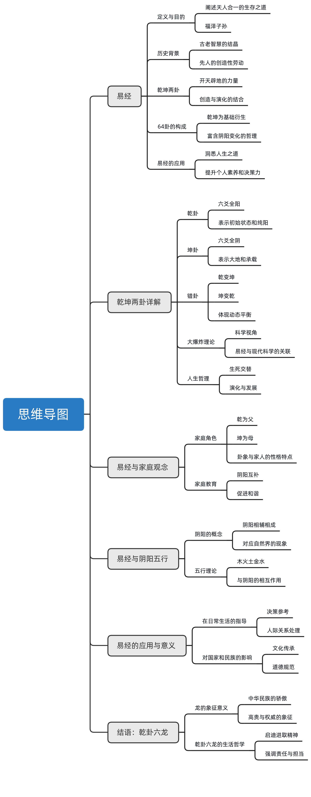

# 0、摘要

《易经》，作为中华文化的重要组成部分，着重阐述了天人合一的生存智慧，其核心理念围绕乾（创造）与坤（演化）展开，透过六十四卦的变化揭示了宇宙万物的生成与发展规律。在传统中国社会中，家庭被视为基本单位，其结构和成员间的相互关系深受《易经》哲学的影响，尤其是乾坤两卦的应用。文章探讨了家庭内部性别角色与人数对家庭和谐及个体心理发展的影响，同时指出了对男孩和女孩的不同期望反映了深层的性别偏好。进一步地，《易经》中的坤卦及其爻变，反映了自然规律与人生哲学，强调了适应变化、预见未来的重要性。乾卦象征宇宙的起源与演化，通过分析其六爻展示了事物发展的全过程和阶段性特征，提出了评价个体或事物时应考虑其发展潜力的观点。综上所述，《易经》的智慧不仅渗透于中国的传统文化与社会生活中，也为我们提供了理解世界和自我成长的深刻视角。

# 1、《易经》：乾坤之学与人生之道
《易经》旨在阐明天人合一的生存之道，其核心概念包括乾卦与坤卦，象征着创造与演化的力量。乾坤两卦的变化揭示了宇宙万物的生成与发展规律。通过探讨乾坤之间的62种变化和组合，《易经》提供了深刻的人生哲学启示。
 

# 2、中华文化中的家庭观念及其影响
中华文化强调家庭的重要性，源于《《易经》》的哲学思想，认为家庭如八卦图所示，包含父、母与子女之间的紧密联系。传统上，中国社会倾向于偏好男孩，但也有着对女孩的深厚情感。讨论指出，性别角色和家庭和谐受到子女数量和性别的影响，特别是当家庭中有多个孩子时，可能会出现各种心理和社会动态。此外，文化中还存在着对特定性别角色的传统期待，这些都深刻地影响着家庭结构和成员间的相互关系。

# 3、探索《易经》中的乾坤之学：生命、家庭与社会责任
《易经》, 孔子, 生生之谓易, 阴阳, 爻, 坤卦, 阳爻, 阴阳变化, 自然规律, 传统观念, 传人, 兄弟关系, 家庭和谐, 生命哲学, 天人合一, 《易经》智慧, 社会责任

# 4、探索《《易经》》中的乾与坤
乾卦象征创造的力量，坤卦代表演化的动力，二者共同构成易学的基本框架。通过对64卦中纯阳的乾卦和纯阴的坤卦的深入分析，探讨了它们如何相互作用以及通过阴阳的结合产生的变化，强调了乾坤配的重要性及其在理解宇宙万物本质中的作用。

# 5、中华文化中的家庭观念与性别认知
中华文化强调家庭的重要性，认为家庭是由乾坤两卦所构成的大家庭，其中包含了父亲、母亲以及子女的角色。人们普遍认为儿子会更像母亲，而女儿则更像父亲，这一现象反映了中华文化的性别认知和家庭价值观。文中讨论了家中不同性别的孩子带来的影响，如第一个女儿能带来和顺的家庭氛围，而过多的女儿可能会导致心理问题。此外，对生男生女的期待也体现了深深植根于文化中的性别偏好。

# 6、《易经》与家族观念：从坤卦的变化看人生
《易经》中的坤卦通过其爻的阴阳变化反映了自然规律及人生哲学。坤卦由全部阴爻变为部分阳爻时，分别代表了长男的出生带来的家庭震动、老二的不服气以及对家庭和谐与计划生育的寓意。这种变化不仅体现了中国传统的家族观念，还暗示了对于人口控制和社会责任的认识。

# 7、探索《易经》中的天地人三才与阴阳平衡
《易经》的乾卦和坤卦象征天地变化，衍生出62种卦象，展现了宇宙间的阴阳相生法则。通过分析天地、人三才以及阴阳属性，强调了地道的刚柔相济、人道的仁义礼智、天道的阴阳互动，并以实际生活中的例子说明了这些原则的重要性。

# 8、理解《易经》中的阴阳变化
《易经》中的阴阳之道是自然界和人类生活的根本规律。通过分析六十四卦及其爻的变化，说明了事物的好坏是相对的，可以相互转化。强调了适应自然变化、预见未来的重要性，并提醒人们不应仅关注当前状态，而应积极寻求改善。

# 9、探索《易经》：乾卦六龙与人生哲理
《易经》中的乾卦，以其六条龙的形象象征宇宙万物的发生和发展，揭示了时间流逝与事物演化的深刻道理。通过分析乾卦六爻，讨论了事物从初始到末尾的发展过程和阶段性的特征，强调了在评价一个人或事物时应考虑到其发展的可能性和未来的潜力。此外，还指出了人们在认识上的常见误区，并提醒人们应该正确理解和应用《易经》的智慧，避免被表面现象迷惑。乾卦六龙的探讨不仅展现了《易经》丰富的哲学思想，也反映了龙在中国文化中的重要地位，及其作为华夏民族象征的意义。

天地生万物，人是万物之灵。几千年以前，我们的先人用智慧创造了天地之学。易经目的在于阐释天人合一的生存之道，福泽子孙。圣人孔子曾说，钱之大使，坤作成物。天地是宇宙的基础，而易经中的乾坤两卦也是开天辟地的两扇大门。那么在易经之中究竟有着怎样玄妙的乾坤之学？借助乾坤两卦，我们又能洞悉怎样的人生之道呢？台湾师范大学曾仕强教授将引领我们一起感悟易经的智慧，请继续关注乾坤一之门。
我们现在一翻开易经就看到前面两个卦，一个叫乾卦，从头到尾六个爻都是阳的。我们把这个叫做代号，就是初99293949539，从头到尾都是酒。当他一变的时候，这六个阳爻一下子通通变成阴爻，那就叫坤卦。所以坤卦是从六条完全没有中断的直线，一下子变到六条通通是中断的阴阳。
你看他的编号马上由初九变初六，92.62。93.6394变6495跟65。上九也变成上6。这两种完全相反的话，在易经里面叫做错卦。他们两卦互错，彼此相处。当然乾卦是六爻都是阳的，突然间变成六爻都是阴的空卦。这种现象只有一种乾坤他是同时出现的，这个我们把它叫做开天辟地。有了天，他一定有地，有了地你才看得到天。
现在的科学认为，宇宙它本来是一团能量。天地不分就是我们所讲的混沌，我们所讲的无极。经过一次大爆炸，我们用爆炸这两个字是在不足以形容当时的状况。因为现在在我们脑海里，爆炸就是砰，不是不不不不不要不起这样，他们是同时而且非常激烈的空前绝后的一次大爆炸。所以给他一个名称叫做大霹雳，英文叫做big bang。这big bang你产生以后。万物就开始出现。
开天辟地，他有两种力量，一种叫做创造，一种叫演化。罨画要根据创造做充分的配合。所以乾卦就代表创造的那股力量，而坤卦就代表这个创造出来的东西，要让他落实，要让它适应，要让它不断的演化的那一股力量。所以我们常常讲乾坤配，乾坤配可以应用到很多地方。
中国人讲无山不成立。因此我们可以说64卦只有三对，一类就是纯阳就叫牵挂，一类是纯阴，就叫坤卦，另外一类就是有阴有阳。因此我们可以了解到，就数量来讲，乾只有一卦，坤只有一卦，有阴有阳，乾坤配它会产生62卦。可是就值来讲各占3分之1，乾坤两卦就占了3分之2，所以我们才会讲乾坤易之门。
乾坤是易学的大门，因为这个人太大，所以他有两扇，一扇叫天，一扇叫地，一扇叫钱，一扇叫坤。两个门同时一打开，里面六十二卦全部呈现清清楚楚。那就叫做宇宙万象。
易经中的64卦看起来很复杂，其实很简单，它们都是由乾卦和坤卦所衍生在乾坤之间的62种变化和组合，所谓一阴一阳之味道。我们如果要参透易经，首先就要弄懂代表阴阳之时的牵挂和坤卦。那么乾卦、空卦分别代表着什么？两卦之间又有着怎样玄妙的联系呢？
中国人为什么特别重视家庭？你看在所有人类当中，家庭观念最浓厚的就是我们中华民族。因为易经告诉我们，八卦他是一个大家庭，其中牵挂是父亲，坤卦是母亲。反而是跟乾卦有关的那三个卦都是女儿，凡是跟坤卦有关的那三个卦反而都是儿子。你说奇怪不奇怪？这没有什么奇怪的。你看现实好了，儿子多半长得像妈妈，女儿多半长得像爸爸，这什么道理？如果你要像妈妈，儿子像爸爸，那男女就分成两种，一种越来越男性化叫做男人味，一种越来越女性化就叫女人味。
因为乾坤它所产生的都是有交错的，所以各位可以看到前挂山羊都是阳刚的。最底下往上上叫做下中上最底下那一行就是最先出现的。所以当乾卦的最底下也要变成阴爻的时候，它就代表长女。展礼是什么卦？就是训卦，就是风。
你没有看到一个家庭，先生女儿这个家庭有什么好处？就是大家比较和顺。因为小女儿很可爱，所以父母也喜欢她，大家都喜欢她她就带来和顺的这种气氛。所以实际上如果生一个的话，那男的跟女的是一样好。如果生两个以上的那大家都不喜欢。
老大是女儿，三个阳爻当中变成阴爻的就叫中女，就是第二个女儿，他是什么卦？是离卦。篱笆它就是带来很美丽的景象。老大出生叫千金，老二女儿出生了，又来了个仙女的。他会让家庭你看最起码一个小家庭，妈妈长的女二女，那么有三个漂亮的女性。这个离卦他也给我们一些问题，就是说这里面就开始闹意见。等到第三个女儿出现了，她就是前卦的最上面那爻，阳爻变阴了，那是少女小女儿出来的那我们就把它叫做对卦。对话就是说你不要不高兴，你要很喜悦的，多一个你有什么关系呢？
实际上各位就知道，这时候已经有很多心里头的问题在里面。我就看到一个人他非生个女儿，非生个儿子不可，一定算生了五个。他心想第六个该是儿子了，生了第六个，那大家就安慰他了也不错。六仙女他理想6000里以后再来个儿子，再生一个七千里。你说他是个男的是什么感觉？我们是不赞成是有这种男女不一样的这种感觉。
孔子说，生生之谓易，阴阳的互动变化生出了万事万物。易经中爻的阴阳变化来自于自然规律，也蕴含着生动而经典的道理。既然牵挂因为三条阳爻的改变而生出三个不同含义的卦象，那么坤卦因为阴阳的改变又会衍生出怎样生动的避孕呢？
在中国社会里面，因为我们总觉得要有一个。儿子他会带给你一番的震动。所以我们先去看一看，坤卦三爻都是阴的，然后最底下这一条变成阳的，就正话就是长男。所以如果这个人姓王，他的名字叫王振，你就知道他是排行老大的儿子，否则不会叫这名字了。李政、龚政、陈政，那您这单子叫真的，他就是因为家里一阵震动说，总算有传人了，总算我们祖宗有人祭祀了，主要是这个意思。所以不要把他想到重男轻女去，不要女儿有女儿的好处。一个女儿从小都会帮忙，家事合计，可是儿子他就发奋努力，他就有一番的表现，因为所有的那种寄望都在他身上了，他怎么能不震动呢？
坤卦的中爻由阴变阳，就是老二。第二个男的出来了，他是什么卦？他是坎卦。为什么砍断了？各位很清楚了。这个老二跟老大他经常是意见不相同的，他不服气的，你找出来你就了不起。老大说你是老二，你不听我越有钱的家庭，越有势的家庭，老大跟老二这两个男的始终是做不好。一个来的时候带来一番震动，一个人来的时候就告诉大家要家和家里不和，兄弟细强，将来是麻烦的。
老三是什么？就是坤卦的最上面，要从阴变阳，那叫艮瓜。艮卦有好几个意思，一个是说你有三个男的，你们家够了的，不要再生了人口那么多。第二个就是说那你如果现在就停止的话，你们家就要做一番规划，怎么样子使它变成一个团体，而不是一个阻碍。
天地生万物，人是万物之灵。几千年以前，我们的先人用智慧创造了天地之学。易经目的在于阐释天人合一的生存之道，福泽子孙。圣人孔子曾说，钱之大使，坤作成物。天地是宇宙的基础，而易经中的乾坤两卦也是开天辟地的两扇大门。那么在易经之中究竟有着怎样玄妙的乾坤之学？借助乾坤两卦，我们又能洞悉怎样的人生之道呢？台湾师范大学曾仕强教授将引领我们一起感悟易经的智慧，请继续关注乾坤一之门。
我们现在一翻开易经就看到前面两个瓜，一个叫乾卦，从头到尾六个爻都是阳的。我们把这个叫做代号，就是初99293949539，从头到尾都是9。当他一变的时候，这六个阳爻一下子通通变成阴爻，那就叫坤卦。所以坤卦是从六条完全没有中断的直线，一下子变到六条通通是中断的阴阳。
你看他的编号马上由初九变初六，92.62。93.6394变6495变65。上九也变成上6。这两种完全相反的话，在易经里面叫做错卦。他们两卦互错，彼此相处。当然乾卦是六爻都是阳的，突然间变成六爻都是阴的空卦。
这种现象只有一种乾坤他是同时出现的，这个我们把它叫做开天辟地。有了天，他一定有地，有了地你才看得到天。现在的科学认为，宇宙它本来是一团能量。天地不分就是我们所讲的混沌，我们所讲的无极。经过一次大爆炸，我们用爆炸这两个字是在不足以形容当时状况。因为现在在我们脑海里爆炸就是砰，不是不不不不不要不是这样，他们是同时而且非常激烈的空前绝后的一次大爆炸。所以给他一个名称叫做大霹雳，英文叫做big bang。
The big bang你产生以后。万物就开始出现。开天辟地，他有两种力量，一种叫做创造，一种叫演化。罨画要根据创造做充分的配合。所以乾卦就代表创造的那股力量，而坤卦就代表这个创造出来的东西，要让他落实，要让它适应，要让它不断的演化的那一股力量。所以我们常常讲乾坤配，乾坤配可以应用到很多地方。
中国人讲无山不成立。因此我们可以说64卦只有三对，一类就是纯阳就叫牵挂，一类是纯阴，就叫坤卦，另外一类就是有阴有阳。因此我们可以了解到，就数量来讲，乾只有一卦，坤只有一卦，有阴有阳，乾坤配它会产生62卦。可是就值来讲各占3分之1，乾坤两卦就占了3分之2，所以我们才会讲乾坤一之门。
乾坤是易学的大门，因为这个人太大，所以他有两扇，一扇叫天，一扇叫地，一扇叫钱，一扇叫坤。两个门同时一打开，里面六十二卦全部呈现清清楚楚。那就叫做宇宙万象。
易经中的64卦看起来很复杂，其实很简单，他们都是有卦和坤卦所衍生在乾坤之间的62种变化和组合，所谓一阴一阳之味道。我们如果要参透易经，首先就要弄懂代表阴阳之时的牵挂和坤卦。那么乾卦、空卦分别代表着什么？两卦之间又有着怎样玄妙的联系呢？
中国人为什么特别重视家庭？你看在所有人类当中，家庭观念最浓厚的就是我们中华民族。因为易经告诉我们，八卦他是一个大家庭，其中牵挂是父亲，坤卦是母亲。凡是跟乾卦有关的那三个卦都是女儿，凡是跟坤卦有关的那三个卦反而都是儿子。你说奇怪不奇怪？这没有什么奇怪的。你看现实好了，儿子多半长得像妈妈，女儿多半长得像爸爸，这什么道理？如果你要像妈妈，儿子像爸爸，那男女就分成两种，一种越来越男性化叫做男人味，一种越来越女性化就叫女人味。
因为乾坤它所产生的都是有交错的，所以各位可以看到牵挂山羊都是阳刚的。最底下往上上叫做下中上最底下那一行就是最先出现的。所以当乾卦的最底下也要变成阴爻的时候，它就代表展礼。展礼是什么卦？就是训卦，就是风。
有没有看到一个家庭，先生女儿这个家庭有什么好处？就是大家比较和顺，因为小女儿很可爱，所以父母也喜欢她，大家都喜欢她她就带来和顺的这种气氛。所以实际上如果生一个的话，那男的跟女的是一样好。如果生两个以上的那大家都不喜欢。
老大是女儿，三个阳爻当中变成阴爻的就叫中女，就是第二个女儿，他是什么卦？是离卦。篱笆它就是带来很美丽的景象。老大出生叫千金，老二女儿出生了，又来了个仙女的。他会让家庭你看最起码一个小家庭妈妈长了女儿女，那么有三个漂亮的女性。这离卦他也给我们一些问题，就是说这里面就开始闹一间。等到第三个女儿出现了，她就是前卦的最上面那爻，阳爻变阴了，那是少女小女儿出来的那我们就把它叫做对卦。对话就是说你不要不高兴，你要很喜悦的，多一个你有什么关系呢？
实际上各位就知道，这时候已经有很多心里头的问题在里面。我就看到一个人他非生个女儿，非生个儿子不可，一定算生了五个。他心想第六个该是儿子了，生了第六个，那大家就安慰他了也不错。六仙女想6000里以后该来个儿子，再生一个七千里。你说他这个男的是什么感觉？我们是不赞成是有这种男女不一样的这种感觉。
孔子说生生之位移，阴阳的互动变化生出了万事万物。易经中爻的阴阳变化来自于自然规律，也蕴含着生动而经典的道理。既然牵挂因为三条羊毛的改变而生出三个不同含义的卦象，那么坤卦因为阴了的改变又会衍生出怎样生动的意蕴呢？
在中国社会里面，因为我们总觉得要有一个。儿子他会带给你一番的震动。所以我们现在看一看，坤卦三爻都是阴的，然后最底下这一条变成阳的，就正话就是长男。所以如果这个人姓王，他的名字叫王振，你就知道他是排行老大的儿子，否则不会叫这名字了。李政、龚政、陈政，那您这单子叫正的，他就是因为家里一阵震动说，总算有传人了，总算我们祖宗有人祭祀了，主要是这个意思。所以不要把他想到重男轻女去，不要女儿有女儿的好处。一个女儿从小都会帮忙，家事合计，可是儿子他就发奋努力，他就有一方的表现，因为所有的那种寄望都在他身上了，他怎么能不震动呢？
坤卦的中爻由阴变阳，就是老二。第二个男的出来了，他是什么卦？他是坎卦。为什么砍价呢？各位很清楚，这个老二跟老大他经常是意见不相同的，他不服气的，你找出来你就来不及了。老大说你是老二，你不听我越有钱的家庭，越有势的家庭，老大跟老二这两个男的始终是做不好。一个来的时候带来一番震动，一个人来的时候就告诉大家要加和，家里不和兄弟细强，将来是麻烦的。
老三是什么？就是坤卦的最上面那一条，从阴变阳，那叫艮瓜。艮卦有好几个意思，一个是说你有三个男的，你们家够了的，不要再生了人口那么多。第二个就是说那你如果现在就停止的话，你们家就要做一番规划，怎么样子使它变成一个团体，而不是一个阻碍。所以同样一个小小的一个变动，你好好去想你会觉得他对我们中国人的影响实在是很大的。
作为易经的两扇门户，乾卦和坤卦在其一开一关之中衍生出62种卦象，如同天地交合，阴阳互相生出了万物。而就在如此微妙的阴阳变化中，却蕴藏着亘古不变的大道理。那么从乾坤两卦的变化中，先人产生了怎样的永恒之道？我们又该如何顺天地之律而行呢？
牵挂变坤卦，坤卦变乾卦。这种非常激烈的变化在易经里面是很少见的这告诉我们什么？告诉我们人世间的事情，店毕竟是少数，不变的还是多数。天天变，样样变，人人变，我们是吃不消的。这句话对现代人很喜欢，讲什么求新求变，应该是好好要去思考思考。
易经三画卦，代表天人地三才。六号过以后，我们就知道了，天有阴阳人有阴阳，地也有阴阳。所以最下面这两条我们把它叫做地道，当中这两条把它叫做人道，最上面那两条我们把它叫做天道。天道是讲阴阳的，人道是讲仁义的，地道是讲刚柔的。
大家仔细去看一看地道，他的刚柔，刚是在第一爻，柔是在上面那一行，为什么？因为地越挖越高，还是越挖越软。如果上面硬，下面越来越软，那太危险了。那你盖高楼一下就垮掉了。幸好那个地上面是比较表层是比较柔的，你用锄头它也可以被你挖洞了。你要挖地基也比较容易，越往下越硬，越往下越硬。所以我们盖高楼的时候，那个地基要打得很深才能够牢固。所以最下面那一条它是钢的，第二爻才是的。
那人人是先讲义还是先讲人人要以义做基础。你讲话合理，你做事情合理，言行都合理，就是合议和复议的要求。才能够证明你的心是有仁慈的，有仁爱的。
天哪，最上面那个爻是阴，而第二阳黄了是阳。中国人只有讲阴阳，从来没有人讲阳阴，这什么道理？你看阴它是往下走的，阴气往下走，你去看我们冷气机多半在上面，他冷气才会往下吹。如果冷气机放在地上，那糟糕了，他这是往地面钻的，上面还是热的，可是热气的时候它是往上扬的。所以阴往下阳往上，阴阳才能交流。
人的头只有一个，是奇数，所以它是阳。人的脚有两只，它是偶数，所以它是阴。但是虽然这里是阳，他的气要阴一点，为什么？就是头脑要冷静一点，不要太热。而脚它需要热，这个人才是健康的，这些都是跟阴阳有关系。
世间万物皆为阴阳，这是万事万物的根本规律，对于我们人类来说，更应该懂得自身生存的阴阳之道，孔子说，易与天地准，故能弥伦。天地之道，史书周易的阴阳之道是天地之理，掌握了这个道理，就掌握了天下的根本规律，那么在现实生活中，我们如何才能做到顺应规律而行？又如何对待多变的种种状况呢？
我们可以81个重卦，也就是六化卦分成两段。因为它本来就分两段了。任何一个床卦都是用两个单卦把它重叠在一起，就叫重叠，就由三化变成六卦。下面这个卦它是代表物质的，上面那个卦是代表能量的。你可以看出来一个人上半身它是能量，下半身是物质。
任何一个卦它有六个爻，就代表六个位置。在这个时间段里面我们把它分成六个阶段，给它六个不同的位阶，每个位阶就叫一个腰。凡是天底下的数，偶数的都叫银，单一的都叫阳，衣生物都叫阳。
135这3个要阳的比较好，所以叫单位。它的瑶池都比较让人家放心，24上上就是6，246这3个爻。它是因为因为如果用阳爻来就叫不当位。我们说清楚一点，135阳爻是属于单位的，如果是阴阳就不到位。246，如果是阴阳就叫单位，如果是阳爻就叫不当位。
现在我们就清楚了，644国海里面六个窑，全部单位的只有一个卦，就叫季继光。你去看记，它是易经里面的第六十三卦。他是初级单位、62单位、93单位、64单位、95单位、上六也单位六个角度单位有一个卦是完全不单位，就是易经的最后一卦，六十四卦叫未济，未济就是还没有完成的意思。你看他第一爻本来应该阳的太阴，第二条本来一个阴的太阳，第三要本来跟阳的它阴，第四要本来阴跟阴的它偏阳，第五条是阳痿，他阴三位应该是阴，他出现阳爻没有医疗单位，所以叫危机。
我们回头看牵挂。前卦大家认为了不起，易经低卦那一定是好的。你不要急了，从头到尾都是阳刚，你马上就知道有三个爻是单位，有三个爻是不单位的。就是那个味跟你的身份是不配合的，跟你的性质是不配合的。一个人有什么能力去做什么事，做得好就表示这是单位的。一个人没有人有能力又占了那个位置，那你怎么做的好，就是不单位的。坤卦也有三爻不单位。如果牵挂都单位，那他们都安安静静都各做各的事情，那也不需要交错了。
所以读到这里大家应该很清楚，易经里面是没有好坏的。好会变坏，坏会变好意思就是好就是坏，坏就是好像这种话要非常小心去解释，否则就变成没有是非了，那还得了。因为好的里面它有很多坏的因素，随时会产生。坏的里面它有很多好的因素，它随时会翻过来，然后把所有坏的成分通通取代掉，他就变好了。一个人新陈代谢，新陈代谢就好像卦的变化一样，每七天你的西方大部分都改变，所以随时可以做一个新的人。易经给我们的启示就是说你不要只看眼前，你要知道未来它的变化。
你现在好不好已经是定的，你抱怨也没有用，你什么都没用，你要想办法让它转好，这才是要紧的。
小小的挂窑橡树，包罗万象，蕴含乾坤。易经的智慧存于天地之间，深藏在六条卦爻的阴阳变化之中，自下而上依次排列的六条卦爻，或阴或阳，其中却蕴含着独特的意义和微妙的变化。那么，六条挂要分别代表着什么？我们又能从中参透怎样的是非道理呢？
每一个卦有六个爻，就是在一个时间段里面，我们给它六个位阶，表示不同阶段的变化。我们先说通例，因为这个是对每个卦都通用的出窑，跟上饶对起来叫做有始有终。一句话，出难知上益之。一爻它到底代表什么？很难清楚，因为事情刚刚开始，看得清楚将来会怎么变化。可是上易知，因为什么？因为你发展到最后一个阶段，已经种种形态都已经很显著，而且大家都看得很清楚，那当然很容易了解了。对年轻的小孩子，你不要一眼断定他没有用，不要因为他还有发展，往往小时了了，大未必佳。而小时候没有什么的也越来越行，它会变化的。
第二爻跟第五爻他又是相对的。恶多欲，五多功。大家有没有发现？
我们中国一开会就想这件事情是上级领导他的指示很明确，他领导有方，我们才能够做的这么好。就是我们很习惯于把所有的功劳都归于上级的领导。我们中国人不会去跟上级领导抢功劳的，不会因为你抢不过他，你要抢他的功劳，那你一定倒霉。因为你把功劳都做给他，所以他就给你一些赞美。一个老板会很放心的去赞美工地主任，或者是生产线的一些老领班。他大概不会轻易去赞美一个经理，赞美一个科长，他不会。但是我们在这里是要提醒各位，你应该看出来，我们现在最大的问题就是我们那个是非标准已经错乱掉了。
我们把对的看成错的，一直骂一直笑他，我们看错的反而看成是对的。你看糟糕不糟糕？你看今天就要有一个人站起来说，这件事情承蒙上级领导的，只是大家就笑他拍马屁。那有什么拍马屁没有上级领导，你有天大本领，你来试试看。因为你把功劳给他他就知道你心中有我。根本的原因就是你心中有我，那我就放心的赞美你。如果你认为这件事情是你自己的能力，你自己的本事，你所花的事情，所做的成果，那你试试看好了。我下次不给你做，我这次也不会赞美你，也不会表扬你。
你去看是不是这样，三跟四是最麻烦的。三多凶，四多聚。你看那个山，它是不上不下，是也是，你说他是上卦，它就跟下卦很接近。三你要小心，因为你从下卦来讲，它已经发展到一个卦的最顶端，物极必反，很快会产生很大的变化。四又是上卦的，刚开始你不知道这个变能不能变得很顺利，不知道。出难知恶，多欲三多兄四多聚五多功上益之。
我们把这个去对照乾卦、坤卦或者其他的62卦，八九不离十。但是我一定要说一句话，一定有例外。易经如果没有例外，那就不叫易经。所以现在很多人说就是这样，一定是这样，铁口之段，那都违反了易经的精神。
乾卦是易经的第一卦，我们把它叫做天下的第一卦。它里面有太多的东西，今天非常普遍的影响到我们中国人。所以我们要把他的六爻好好来分析一下。我们下一个单元要讲乾卦六龙，前卦代表六条龙，他应该怎么样子采取合理的行动？乾卦六龙对中国人影响很深，我们下一次一起来研讨，谢谢大家。
自古以来，龙作为华夏民族的象征，被中国人所尊崇，在被尊为群经之首、诸子百家之源的易经中，首卦便是以龙为代表的乾卦，那么我们中华民族为什么要将自己称作龙的传人呢？而一千手挂的六条羊羊之龙，又暗含着怎样的人生道理呢？感悟易经的智慧，请继续关注乾卦六龙。

