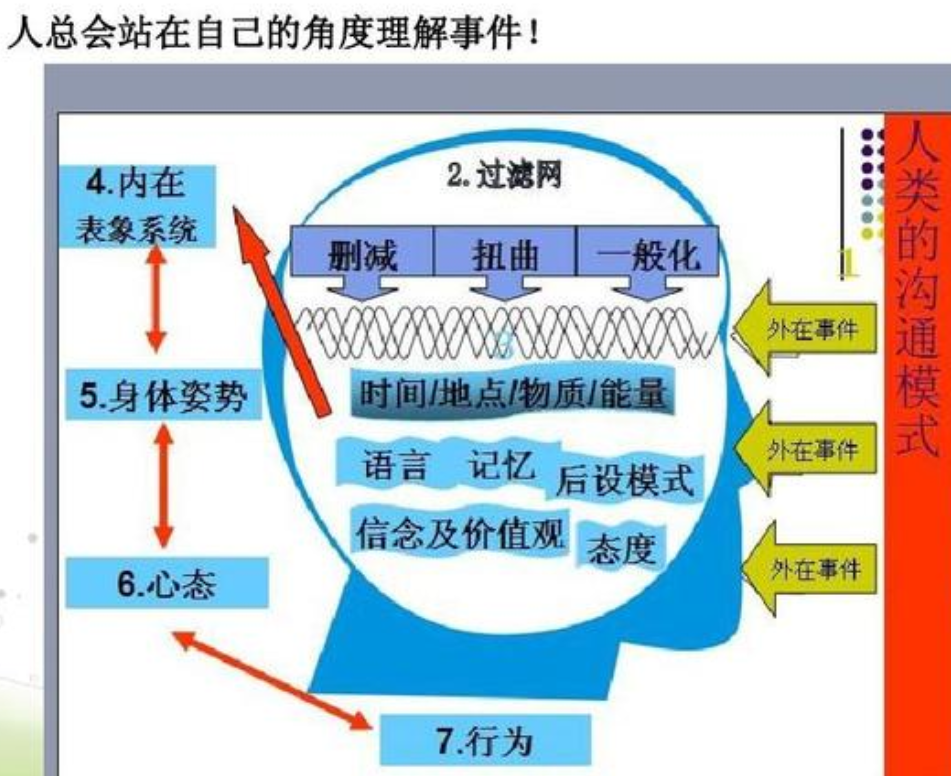

达梦教育

www.admway.com

# 演讲与呈现技巧

演讲跟智慧语言是什么样关系？

如何做一个有影响力的演讲，获得听众的认同呢？

引入刘媛媛的一段演讲《年轻人能为世界做什么？》

平静一下

我是一名法学院的学生，我的每一门课的教授都曾经在他的课堂上讲过这么一句话。他们常常说法律是这么规定的。但是现实生活是一种很神奇的生活，在现实生活中，那些尊重规则的老实人往往一辈子都默默无闻，反倒是那些弄虚作假的人，到最后会名利双收。于是乎像我这样的年轻人，就经常有那些看着很有经验的前辈过来拍拍你的肩膀，跟你说，年轻人你还不懂。

我想问的是，我们年轻人你能为这个世界做什么？总有一天银行行长会是90后，企业家会是90后，甚至国家主席都会是90后，当全社会都被90后占领的时候，我想问你们90后们，大家想把这个社会。变成什么样？

我知道，不是每一个人他都能够成为那种站在风口浪尖上去把握国家命运的人物。你我都是再普通不过的升斗小民，是这个庞大的社会机器上一颗小小的螺丝钉。

读书的时候，每天都被父母耳提面命，说你干啥你都不要给我耽误学习。毕业的时候到处投简历，凄凄惶惶的等一家企业收留自己。逢年过节被逼婚结婚买了房子，要花自己年轻的时候的最好的20年来来偿还贷款。让每一个年轻人都忙着生存而没有梦想，没有时间关心政治，没有时间关心环境，没有时间关心国家的命运。还哪有什么精力去为这社会做什么？

但是后来我发现还是有一件事情，你跟我都可以做到。这件事情就是我们这一代人在我们老去的路上，一定不要变坏，不要变成你年轻的时候最痛恨最厌恶的那种成年人。

如果将来你去路边摆摊儿，你就不要卖地沟油小吃，你不要缺斤短两。你将来开了工厂，当了老板，你不要偷工减料，生产一些次品。每一个普通人，他在自己普通的岗位上做一个好人，是有非常严重的意义的。

因为我们每一个人生下来都注定会改变世界，不是一个学法律的。如果我将来是一个公正严明的法官，那么这个社会就因为多了一个好法官而变好了一点点。我希望大家都记住，即使给了你10万个理由让你去作恶，你都要保持自己的操守跟底线。仅仅就因为一个理由，这个理由就是你不是一个禽兽，是一个人。我更希望我们所有的90后们，你们都能成为那种难能可贵的年轻人，一辈子都嫉恶如仇，绝不随波逐流，也绝不趋炎附势。你绝不摧眉折腰，也绝不放弃自己的原则，你绝不绝不失望于人性。所以我亲爱的90后们，如果将来暂时有内疚跟你说，年轻人你不要看不惯，你要适应这个社会。这时候你就应该像一个真正的勇士一样，直面他，告诉他我跟你不一样，我不是来适应社会的，我是来改变社会的，谢谢。

一个有影响力的演讲是靠什么来决定的呢？很好的口才还是卓越的思维模式？

# `思维模式 VS 口才技巧`

在赞赏一个演讲者滔滔不绝的雄辩之才的时候，我们的确会被他的这个雄辩的口才所折服。然而一个有影响力的演讲，他的背后到底是什么呢？是它是影响力来自何方？

最近有一本书，叫《未来是湿的》
既然有湿的那就有干的。说未来是湿的，它其实是说过去是硬的，现在是软的。未来是湿的。

硬的是什么意思呢？

就是说一个经济社会的发展，在过去它靠的是它的硬实力、它的资本、它的技术、它的厂房、人力资源，靠的是这巨大的资源的投入，所以说它是硬的。

时至今日，我们进入了知识经济时代，互联网时代，我们突然发现一个身无分文的人却可能叱咤风云。比如马云，当年他就是身无分文，他靠的是什么呢？他没有资本，身边的人就寥寥无几，他仅仅靠一个概念就缔造了一个网络帝国，所以说它是软的。

那么未来是湿的又是什么含义呢？
我们经常会听到这么一句话，说某某人讲课他有很多的干货。

干货是什么呢？
实实在在的东西，实用。

人类的沟通模式

人类有视觉、听觉、触觉这些感官系统接收外部信号，然后经过大脑的过滤、扭曲和一般化，然后会在大脑中形成内表象系统，内视觉、内感觉、内触觉形成概念，最后沉淀成概念。最后影响我们的心态，又影响了我们的行为。

总之我们人类是通过视觉、听觉、触觉来进行学习的。

# 领袖演讲中的隐喻

《红色恋人》

#todo

#movie #张国荣 #梅婷

https://movie.douban.com/subject/1298207/

跟蒋介石先生打了十来年的交道。深知其人其道。我对你们讲，他实在是个聋子，而且聋的厉害。你想他的耳朵稍微听进去一点东西都得放枪。

我要告诉你们，此刻正有一群顽强的战士在不屈不挠的在坚持着他们自己的信念，他们的理想，他们的主义，他们的名字叫红军。

《列宁在一九一八》

#todo

https://movie.douban.com/subject/1678781/

同志们，当革命还正在进行的时候，就是说当整个阶级在灭亡，他和一个人的死亡根本是完全不相同的。人死后尸体可以抬出去，但是旧社会在灭亡了的时候，很可惜，资产阶级的这个尸首，那就不可能把他一下子钉在棺材里埋葬在坟墓里，资产阶级的尸首在我们心里头腐烂着，他把毒气传染给大家，他在发散着臭气！

来自：https://movie.douban.com/review/13516748/

# 隐喻

当年，毛泽东和蒋介石都同一个时代的人。

蒋介石说三民主义能够救中国，毛泽东说打土豪分田地。你觉得当时的老百姓能听懂哪句话呢？

毛泽东的话谁都听得明白。于是于是乎出现的情况就是全国几万万人都跟他一起闹革命去了。从此以后他缔造了一个新的国家。

所以一个政治领袖的他的语言的魅力在哪呢？我们不难发现，其实毛泽东其实是一个演艺大师，他的讲话我们就可以说他是湿的。为什么说他是湿的？因为他很善于引用各种隐喻。

比如说毛泽东在愚公移山这篇文章里面，他就引用了中国古代有个寓言故事叫做《愚公移山》。

说的是在中国华北，有一位老人叫做愚公，因为他住在华北叫做北山愚公。在他家门在他家门前面有两座大山挡住了他们的去路，一座在这叫做太行山，一座叫做王屋山。愚公下决心带领他的儿子们要挖掉这两座山，有个老头名叫自首的看了发笑说，就凭你们素人，要挖这两座山是完全不可能的，愚公回答说，我死了以后有我的儿子，儿子死了又有孙子，这是山虽然很高，但是却不会再增高了，挖一点就会少一点，有什么挖不平呢？愚公批驳了自首的错误思想，带领他们的儿子们继续挖山不止。这件事终于感动了上帝，于是派了两个神仙下凡把两座山背走了。

现在也有两座压在中国人民头上的大山，一座叫做帝国主义，一座叫做封建主义。中国共产党早就下了决心要挖掉这两座大山。我们一定要努力工作，我们要团结全国人民一道工作，我们也会感动上帝的。这个上帝不是别人，正是全中国人、全中国的人民大众。全国人民大众和我们一起起来挖掉这两座大山，有什么挖不平呢？

这正是作为一个政治领袖，他的讲话，他的影响力之所在，因为他用了很多隐喻。

